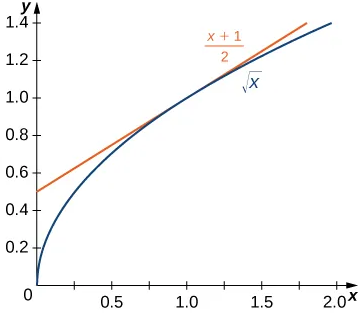

# Differentiation

These notes are designed for use in the AP Physics C classroom and the intent is *not* to take the place of any formal instruction in calculus.  Rather, the goal is to review the necessary concepts from honors precalculus and move on to solving the differentiation problems needed in this class.  For this reason, it would seem *extremely* brief and we'd look like we are almost going "plug and chug" - yes we are.  But this is *not* a calculus class.

Unless otherwise noted, all figures are taken from [*OpenStax Calculus Volume I*](https://openstax.org/books/calculus-volume-1/pages/1-introduction).  This is essentially a highlight tour of Ch. 2.1-2 of Larson, *Calculus of a Single Variable* (9th Ed).

## Tangent Lines and Derivatives

You can see for a given function that we can draw a *tangent line* to it at a given point.

and this can be seen as the limit of the *secant line*

$$\begin{equation}\frac{\mbox{d}y}{\mbox{d}x} = \lim\limits_{\Delta x \to 0} \frac{f(x+\Delta x)-f(x)}{\Delta x}\end{equation}$$

* As a matter of notation, we use prime signs to denote derivatives, so $\displaystyle \frac{dy}{dx} \equiv y^\prime(x)$
* You can also have *higher order* derivatives, in that we have *derivatives of the derivative*.  So, for example, $$\displaystyle \frac{\mbox{d}^2y}{\mbox{d}x^2} = \frac{\mbox{d}}{\mbox{{d}x}}\frac{\mbox{dy}}{\mbox{d}x}$$ is called the *second derivative* of $y(x)$.  This will become important when we relate position and velocity with the *acceleration*.  Similarly, you can use multiple primes, so $\displaystyle \frac{d^2y}{dx^2} = y^{\prime\prime}(x)$.

### Application in Physics: Velocities and Rates of Change

This is, as you can see, the *rate of change of $y$* as a function of $x$.  Therefore, the instantaneous velocity is the *derivative* of the position as a function of time

$$\begin{equation} v = \frac{\mbox{d}x}{\mbox{d}t}\end{equation}$$

and while the *instantaneous rate* is the slope of the tangent line, the *average rate* is the slope of the *secant line*

You are advised to read [*OpenStax Calculus Volume I*, Ch. 3.4 (Derivatives as Rates of Change)](https://openstax.org/books/calculus-volume-1/pages/3-4-derivatives-as-rates-of-change) for further examples of how derivatives are rates of change.

## Solving Derivatives

To solve for the derivative, generally we follow a series of *rules* that tell you how specific derivatives can be differentiated.  We will see quite a few of these which can be found in the [AP Physics C (Meechanics) equation sheet](https://apcentral.collegeboard.org/media/pdf/ap-physics-c-mechanics-equations-sheet.pdf).  For now, we will focus on solving problems involving *polynomials* and *trigonometric functions*.[^1]

### The Constant Rule

Common sense dictates that $\displaystyle \frac{\mbox{d}}{\mbox{d}x}[c] = 0$ (where $c$ is a constant).

### Polynomials: The Power Rule

It can be shown that[^2]

$$\begin{equation} \frac{\mbox{d}}{\mbox{d}x}[x^n] = nx^{n-1}\end{equation}$$

> #### Example
>
> What is the derivative of $x^4$?
>
> 

Answer
Here, <math><mrow><mi>n</mi><mo>=</mo></mrow><mrow><mn>4</mn></mrow></math>
>  and therefore <math display="block" class="tml-display" style="display:block math;"><mstyle scriptlevel="0" displaystyle="true"><mfrac><mtext>d</mtext><mrow><mtext>d</mtext><mi>x</mi></mrow></mfrac><msup><mi>x</mi><mn class="tml-sml-pad">4</mn></msup><mo>=</mo><mn>4</mn><msup><mi>x</mi><mrow class="tml-sml-pad"><mn>4</mn><mo>−</mo><mn>1</mn></mrow></msup><mo>=</mo><mn>4</mn><msup><mi>x</mi><mn class="tml-sml-pad">3</mn></msup></mstyle></math>
> 

You should note that $n \in \R$ - there is no rule requiring that the exponent be a whole number or be positive.

> #### Class Question
>
> Find the derivative of the function $\displaystyle f(x) = \frac{1}{x^4}$
>
> 

Answer
Since this is equivalent to <math><mrow><mi>f</mi><mo form="prefix" stretchy="false">(</mo><mi>x</mi><mo form="postfix" stretchy="false">)</mo><mo>=</mo></mrow><mrow><msup><mi>x</mi><mrow class="tml-sml-pad"><mo lspace="0em" rspace="0em">−</mo><mn>4</mn></mrow></msup></mrow></math>, the derivative is <math><mstyle scriptlevel="0" displaystyle="true"><mo>−</mo><mn>4</mn><msup><mi>x</mi><mrow class="tml-sml-pad"><mo lspace="0em" rspace="0em">−</mo><mn>5</mn></mrow></msup><mo>=</mo><mo form="prefix" stretchy="false">−</mo><mfrac><mn>4</mn><msup><mi>x</mi><mn class="tml-sml-pad">5</mn></msup></mfrac></mstyle></math>

### The Constant Multiple Rule

If we multiply a function by a constant, the derivative is multiplied by that constant:

$$\begin{equation}\frac{\mbox{d}}{\mbox{d}x}[cf(x)] = c \times \frac{\mbox{d}f(x)}{\mbox{d}x}\end{equation}$$

> #### Example
>
> What is the derivative with respect to time $t$ of $f(t) = 6t^3$?
>
> 

Answer
<math display="block" class="tml-display" style="display:block math;"><mtable displaystyle="true" columnalign="right left" class="tml-jot"><mtr><mtd class="tml-right" style="padding-left:0em;padding-right:0em;"><mrow><msup><mi>f</mi><mo lspace="0em" rspace="0em" class="tml-prime tml-lrg-pad">′</mo></msup><mo form="prefix" stretchy="false">(</mo><mi>t</mi><mo form="postfix" stretchy="false">)</mo></mrow></mtd><mtd class="tml-left" style="padding-left:0em;padding-right:0em;"><mrow><mo>=</mo><mn>6</mn><mfrac><mtext>d</mtext><mrow><mtext>d</mtext><mi>t</mi></mrow></mfrac><msup><mi>t</mi><mn class="tml-med-pad">3</mn></msup></mrow></mtd></mtr><mtr><mtd class="tml-right" style="padding-left:0em;padding-right:0em;"><mrow></mrow></mtd><mtd class="tml-left" style="padding-left:0em;padding-right:0em;"><mrow><mo>=</mo><mn>6</mn><mo form="prefix" stretchy="false">(</mo><mn>3</mn><msup><mi>t</mi><mn class="tml-med-pad">2</mn></msup><mo form="postfix" stretchy="false">)</mo></mrow></mtd></mtr><mtr><mtd class="tml-right" style="padding-left:0em;padding-right:0em;"><mrow></mrow></mtd><mtd class="tml-left" style="padding-left:0em;padding-right:0em;"><mrow><mo>=</mo><mn>18</mn><msup><mi>t</mi><mn class="tml-med-pad">2</mn></msup></mrow></mtd></mtr></mtable></math>
> 

### The Sum and Difference Rule

I know it's stated algebraically, but really what it means is that you can differentiate each term separately and add/subtract them.

$$\displaystyle \frac{d}{dx}[f(x)+g(x)] = f^\prime(x) + g^\prime(x) $$

> #### Example
>
> Differentiate $\displaystyle f(x) = -\frac{x^4}{4} + 3x^3 - 2x$
>
> 

Answer
<math display="block" class="tml-display" style="display:block math;"><mtable displaystyle="true" columnalign="right left" class="tml-jot"><mtr><mtd class="tml-right" style="padding-left:0em;padding-right:0em;"><mrow><msup><mi>f</mi><mo class="tml-prime tml-lrg-pad">′</mo></msup><mo form="prefix" stretchy="false">(</mo><mi>x</mi><mo form="postfix" stretchy="false">)</mo></mrow></mtd><mtd class="tml-left" style="padding-left:0em;padding-right:0em;"><mrow><mo>=</mo><mo form="prefix" stretchy="false">−</mo><mfrac><mn>1</mn><mn>4</mn></mfrac><mfrac><mi>d</mi><mrow><mi>d</mi><mi>x</mi></mrow></mfrac><mo form="prefix" stretchy="false">(</mo><msup><mi>x</mi><mn class="tml-sml-pad">4</mn></msup><mo form="postfix" stretchy="false">)</mo><mo>+</mo><mn>3</mn><mfrac><mi>d</mi><mrow><mi>d</mi><mi>x</mi></mrow></mfrac><mo form="prefix" stretchy="false">(</mo><msup><mi>x</mi><mn class="tml-sml-pad">3</mn></msup><mo form="postfix" stretchy="false">)</mo><mo>−</mo><mn>2</mn><mfrac><mi>d</mi><mrow><mi>d</mi><mi>x</mi></mrow></mfrac><mi>x</mi></mrow></mtd></mtr><mtr><mtd class="tml-right" style="padding-left:0em;padding-right:0em;"><mrow></mrow></mtd><mtd class="tml-left" style="padding-left:0em;padding-right:0em;"><mrow><mo>=</mo><mo form="prefix" stretchy="false">−</mo><mfrac><mn>1</mn><mn>4</mn></mfrac><mo form="prefix" stretchy="false">(</mo><mn>4</mn><msup><mi>x</mi><mn class="tml-sml-pad">3</mn></msup><mo form="postfix" stretchy="false">)</mo><mo>+</mo><mn>3</mn><mo form="prefix" stretchy="false">(</mo><mn>3</mn><msup><mi>x</mi><mn class="tml-sml-pad">2</mn></msup><mo form="postfix" stretchy="false">)</mo><mo>−</mo><mn>2</mn><mo form="prefix" stretchy="false">(</mo><msup><mi>x</mi><mn class="tml-sml-pad">0</mn></msup><mo form="postfix" stretchy="false">)</mo></mrow></mtd></mtr><mtr><mtd class="tml-right" style="padding-left:0em;padding-right:0em;"><mrow></mrow></mtd><mtd class="tml-left" style="padding-left:0em;padding-right:0em;"><mrow><mo>=</mo><mo form="prefix" stretchy="false">−</mo><msup><mi>x</mi><mn class="tml-sml-pad">3</mn></msup><mo>+</mo><mn>9</mn><msup><mi>x</mi><mn class="tml-sml-pad">2</mn></msup><mo>−</mo><mn>2</mn></mrow></mtd></mtr></mtable></math>

> #### Class Question
>
> What is the derivative with respect to $x$ of $g(x) = x^3 + 5x^4$?
>
> 

Answer
<math><mrow><msup><mi>g</mi><mo class="tml-prime tml-sml-pad">′</mo></msup><mo form="prefix" stretchy="false">(</mo><mi>x</mi><mo form="postfix" stretchy="false">)</mo><mo>=</mo></mrow><mrow><mn>3</mn><msup><mi>x</mi><mn class="tml-sml-pad">2</mn></msup><mo>+</mo></mrow><mrow><mn>5</mn><mo form="prefix" stretchy="false">(</mo><mn>4</mn><msup><mi>x</mi><mn class="tml-sml-pad">3</mn></msup><mo form="postfix" stretchy="false">)</mo><mo>=</mo></mrow><mrow><mn>3</mn><msup><mi>x</mi><mn class="tml-sml-pad">2</mn></msup><mo>+</mo></mrow><mrow><mn>20</mn><msup><mi>x</mi><mn class="tml-sml-pad">3</mn></msup></mrow></math>

### Derivatives of the Sine and Cosine Functions

It can be shown that

* $\displaystyle \frac{d}{dx}[\sin x] = \cos x$
* $\displaystyle \frac{d}{dx} [\cos x] = -\sin x$

### Chain Rule

The crux to the chain rule is to deal with some complex function like $f(x) = \sqrt{x^2+3}$.  In this case, none of the derivatives appear to apply.  However, we could define $u(x) = x^2 + 3$, and if I do that the function is $f(u) = \sqrt{u}$.

It can be shown in this case that the *chain rule* applies

$$\displaystyle \begin{equation}\frac{df}{dx} = \frac{df}{du} \cdot \frac{du}{dx}\end{equation}$$

> #### Example
>
> Find $\displaystyle \frac{d}{dx} [\sin 2x]$
>
> 

Answer
We would start by defining <math><mrow><mi>u</mi><mo>=</mo></mrow><mrow><mn>2</mn><mi>x</mi></mrow></math>, and then as <math><mrow><mrow><mi>sin</mi><mo>⁡</mo><mspace width="0.1667em"></mspace></mrow><mn>2</mn><mi>x</mi><mo>=</mo></mrow><mrow><mrow><mi>sin</mi><mo>⁡</mo><mspace width="0.1667em"></mspace></mrow><mi>u</mi></mrow></math>,
>     <math display="block" class="tml-display" style="display:block math;"><mtable displaystyle="true" columnalign="right left" class="tml-jot"><mtr><mtd class="tml-right" style="padding-left:0em;padding-right:0em;"><mrow><mfrac><mi>d</mi><mrow><mi>d</mi><mi>x</mi></mrow></mfrac><mo form="prefix" stretchy="false">[</mo><mrow><mi>sin</mi><mo>⁡</mo><mspace width="0.1667em"></mspace></mrow><mn>2</mn><mi>x</mi><mo form="postfix" stretchy="false">]</mo></mrow></mtd><mtd class="tml-left" style="padding-left:0em;padding-right:0em;"><mrow><mo>=</mo><mrow><mo fence="true" form="prefix">(</mo><mfrac><mi>d</mi><mrow><mi>d</mi><mi>u</mi></mrow></mfrac><mo form="prefix" stretchy="false">[</mo><mrow><mi>sin</mi><mo>⁡</mo><mspace width="0.1667em"></mspace></mrow><mi>u</mi><mo form="postfix" stretchy="false">]</mo><mo fence="true" form="postfix">)</mo></mrow><mo>⋅</mo><mrow><mo fence="true" form="prefix">(</mo><mfrac><mi>d</mi><mrow><mi>d</mi><mi>x</mi></mrow></mfrac><mo form="prefix" stretchy="false">(</mo><mn>2</mn><mi>x</mi><mo form="postfix" stretchy="false">)</mo><mo fence="true" form="postfix">)</mo></mrow></mrow></mtd></mtr><mtr><mtd class="tml-right" style="padding-left:0em;padding-right:0em;"><mrow></mrow></mtd><mtd class="tml-left" style="padding-left:0em;padding-right:0em;"><mrow><mo>=</mo><mn>2</mn><mrow><mspace width="0.1667em"></mspace><mi>cos</mi><mo>⁡</mo><mspace width="0.1667em"></mspace></mrow><mi>u</mi><mo>=</mo><mn>2</mn><mrow><mspace width="0.1667em"></mspace><mi>cos</mi><mo>⁡</mo><mspace width="0.1667em"></mspace></mrow><mn>2</mn><mi>x</mi></mrow></mtd></mtr></mtable></math>

> #### Class Question
>
> Find the derivative of the function $f(t) = (7+3t)^{6/5}$
>
> 

Answer
If  we define <math><mrow><mi>u</mi><mo>=</mo></mrow><mrow><mn>7</mn><mo>+</mo></mrow><mrow><mn>3</mn><mi>t</mi></mrow></math>
>     , then <math display="block" class="tml-display" style="display:block math;"><mtable displaystyle="true" columnalign="right left" class="tml-jot"><mtr><mtd class="tml-right" style="padding-left:0em;padding-right:0em;"><mfrac><mrow><mi>d</mi><mi>f</mi><mo form="prefix" stretchy="false">(</mo><mi>t</mi><mo form="postfix" stretchy="false" lspace="0em" rspace="0em">)</mo></mrow><mrow><mi>d</mi><mi>t</mi></mrow></mfrac></mtd><mtd class="tml-left" style="padding-left:0em;padding-right:0em;"><mrow><mo>=</mo><mfrac><mrow><mi>d</mi><mi>f</mi></mrow><mrow><mi>d</mi><mi>u</mi></mrow></mfrac><mo>×</mo><mfrac><mrow><mi>d</mi><mi>u</mi></mrow><mrow><mi>d</mi><mi>t</mi></mrow></mfrac></mrow></mtd></mtr><mtr><mtd class="tml-right" style="padding-left:0em;padding-right:0em;"><mfrac><mrow><mi>d</mi><mi>f</mi></mrow><mrow><mi>d</mi><mi>u</mi></mrow></mfrac></mtd><mtd class="tml-left" style="padding-left:0em;padding-right:0em;"><mrow><mo>=</mo><mfrac><mi>d</mi><mrow><mi>d</mi><mi>u</mi></mrow></mfrac><mo form="prefix" stretchy="false">(</mo><msup><mi>u</mi><mrow class="tml-sml-pad"><mn>6</mn><mi>/</mi><mn>5</mn></mrow></msup><mo form="postfix" stretchy="false">)</mo></mrow></mtd></mtr><mtr><mtd class="tml-right" style="padding-left:0em;padding-right:0em;"><mrow></mrow></mtd><mtd class="tml-left" style="padding-left:0em;padding-right:0em;"><mrow><mo>=</mo><mfrac><mn>6</mn><mn>5</mn></mfrac><msup><mi>u</mi><mrow class="tml-sml-pad"><mn>1</mn><mi>/</mi><mn>5</mn></mrow></msup></mrow></mtd></mtr><mtr><mtd class="tml-right" style="padding-left:0em;padding-right:0em;"><mfrac><mrow><mi>d</mi><mi>u</mi></mrow><mrow><mi>d</mi><mi>t</mi></mrow></mfrac></mtd><mtd class="tml-left" style="padding-left:0em;padding-right:0em;"><mrow><mo>=</mo><mfrac><mi>d</mi><mrow><mi>d</mi><mi>t</mi></mrow></mfrac><mo form="prefix" stretchy="false">(</mo><mn>7</mn><mo>+</mo><mn>3</mn><mi>t</mi><mo form="postfix" stretchy="false">)</mo></mrow></mtd></mtr><mtr><mtd class="tml-right" style="padding-left:0em;padding-right:0em;"><mrow></mrow></mtd><mtd class="tml-left" style="padding-left:0em;padding-right:0em;"><mrow><mo>=</mo><mn>3</mn></mrow></mtd></mtr><mtr><mtd class="tml-right" style="padding-left:0em;padding-right:0em;"><mfrac><mrow><mi>d</mi><mi>f</mi><mo form="prefix" stretchy="false">(</mo><mi>t</mi><mo form="postfix" stretchy="false" lspace="0em" rspace="0em">)</mo></mrow><mrow><mi>d</mi><mi>t</mi></mrow></mfrac></mtd><mtd class="tml-left" style="padding-left:0em;padding-right:0em;"><mrow><mo>=</mo><mfrac><mrow><mi>d</mi><mi>f</mi></mrow><mrow><mi>d</mi><mi>u</mi></mrow></mfrac><mo>×</mo><mfrac><mrow><mi>d</mi><mi>u</mi></mrow><mrow><mi>d</mi><mi>t</mi></mrow></mfrac></mrow></mtd></mtr><mtr><mtd class="tml-right" style="padding-left:0em;padding-right:0em;"><mrow></mrow></mtd><mtd class="tml-left" style="padding-left:0em;padding-right:0em;"><mrow><mo>=</mo><mrow><mo fence="true" form="prefix">(</mo><mfrac><mn>6</mn><mn>5</mn></mfrac><msup><mi>u</mi><mrow class="tml-sml-pad"><mn>1</mn><mi>/</mi><mn>5</mn></mrow></msup><mo fence="true" form="postfix">)</mo></mrow><mo>⋅</mo><mn>3</mn></mrow></mtd></mtr><mtr><mtd class="tml-right" style="padding-left:0em;padding-right:0em;"><mrow></mrow></mtd><mtd class="tml-left" style="padding-left:0em;padding-right:0em;"><mrow><mo>=</mo><mfrac><mn>18</mn><mn>5</mn></mfrac><mo form="prefix" stretchy="false">(</mo><mn>7</mn><mo>+</mo><mn>3</mn><mi>t</mi><msup><mo form="postfix" stretchy="false">)</mo><mrow><mn>1</mn><mi>/</mi><mn>5</mn></mrow></msup></mrow></mtd></mtr></mtable></math>

##  Higher Derivatives

As indicated above, we can have higher derivatives.  These just mean that we are differentiating again.  So, for example, the second derivative $\displaystyle \frac{d^2 f}{dx^2} = \frac{d}{df}\left(\frac{df}{dx}\right)$ and we can find it accordingly.

> ### Example
>
> If $f(x) = \sin x$, find $\displaystyle f^{\prime \prime}(x) = \frac{d^2f(x)}{dx^2}$.
>
> 

Answer
<math display="block" class="tml-display" style="display:block math;"><mtable displaystyle="true" columnalign="right left" class="tml-jot"><mtr><mtd class="tml-right" style="padding-left:0em;padding-right:0em;"><mfrac><mrow><msup><mi>d</mi><mn class="tml-lrg-pad">2</mn></msup><mi>f</mi></mrow><mrow><mi>d</mi><msup><mi>x</mi><mn class="tml-sml-pad">2</mn></msup></mrow></mfrac></mtd><mtd class="tml-left" style="padding-left:0em;padding-right:0em;"><mrow><mo>=</mo><mfrac><mi>d</mi><mrow><mi>d</mi><mi>x</mi></mrow></mfrac><mrow><mo fence="true" form="prefix">(</mo><mfrac><mrow><mi>d</mi><mi>f</mi></mrow><mrow><mi>d</mi><mi>x</mi></mrow></mfrac><mo fence="true" form="postfix">)</mo></mrow></mrow></mtd></mtr><mtr><mtd class="tml-right" style="padding-left:0em;padding-right:0em;"><mrow></mrow></mtd><mtd class="tml-left" style="padding-left:0em;padding-right:0em;"><mrow><mo>=</mo><mfrac><mi>d</mi><mrow><mi>d</mi><mi>x</mi></mrow></mfrac><mrow><mo fence="true" form="prefix">(</mo><mfrac><mi>d</mi><mrow><mi>d</mi><mi>x</mi></mrow></mfrac><mo form="prefix" stretchy="false">(</mo><mrow><mi>sin</mi><mo>⁡</mo><mspace width="0.1667em"></mspace></mrow><mi>x</mi><mo form="postfix" stretchy="false">)</mo><mo fence="true" form="postfix">)</mo></mrow></mrow></mtd></mtr><mtr><mtd class="tml-right" style="padding-left:0em;padding-right:0em;"><mrow></mrow></mtd><mtd class="tml-left" style="padding-left:0em;padding-right:0em;"><mrow><mo>=</mo><mfrac><mi>d</mi><mrow><mi>d</mi><mi>x</mi></mrow></mfrac><mo form="prefix" stretchy="false">(</mo><mrow><mi>cos</mi><mo>⁡</mo><mspace width="0.1667em"></mspace></mrow><mi>x</mi><mo form="postfix" stretchy="false">)</mo></mrow></mtd></mtr><mtr><mtd class="tml-right" style="padding-left:0em;padding-right:0em;"><mrow></mrow></mtd><mtd class="tml-left" style="padding-left:0em;padding-right:0em;"><mrow><mo>=</mo><mo form="prefix" stretchy="false">−</mo><mrow><mi>sin</mi><mo>⁡</mo><mspace width="0.1667em"></mspace></mrow><mi>x</mi></mrow></mtd></mtr></mtable></math>  Incidentally, this result will become important when we look at oscillations.

## Maxima and Minima

Often, we need to consider points where a function is maximized or minimized:

* We are interested in where on a coordinate the energy is minimized.
* When is the motion of the particle stopped?

These *extrema* are seen as "flat points" on the plot:

Focus here on the ones that are not at the ends of the line,[^3]  In this case, we can see that the slope of the line is zero.  Therefore, we can state that

> ### Fermat's Theorem[^4]
>
> If $f(x)$ has a local extremum at $x=c$ and $f(x)$ is differentiable at $c$, then $f^\prime (c)=0$.

The application for this, as you might see, is to identify points where (for example) the position of the particle is changed.

> ### Example
>
> Find the local extrema of $y=4x^3−3x$
>
> 

Answer
The key idea here is that we need to find the points where <math>
>   <mstyle scriptlevel="0" displaystyle="true">
>     <mfrac>
>       <mrow>
>         <mi>d</mi>
>         <mi>y</mi>
>       </mrow>
>       <mrow>
>         <mi>d</mi>
>         <mi>x</mi>
>       </mrow>
>     </mfrac>
>     <mo>=</mo>
>     <mn>0</mn>
>   </mstyle>
>     </math>.  Therefore <math display="block" class="tml-display" style="display:block math;"><mtable displaystyle="true" columnalign="right left" class="tml-jot"><mtr><mtd class="tml-right" style="padding-left:0em;padding-right:0em;"><mfrac><mrow><mi>d</mi><mi>y</mi></mrow><mrow><mi>d</mi><mi>x</mi></mrow></mfrac></mtd><mtd class="tml-left" style="padding-left:0em;padding-right:0em;"><mrow><mo>=</mo><mn>0</mn></mrow></mtd></mtr><mtr><mtd class="tml-right" style="padding-left:0em;padding-right:0em;"><mrow><mfrac><mi>d</mi><mrow><mi>d</mi><mi>x</mi></mrow></mfrac><mo form="prefix" stretchy="false">(</mo><mn>4</mn><msup><mi>x</mi><mn class="tml-sml-pad">3</mn></msup><mo>−</mo><mn>2</mn><mi>x</mi><mo form="postfix" stretchy="false">)</mo></mrow></mtd><mtd class="tml-left" style="padding-left:0em;padding-right:0em;"><mrow><mo>=</mo><mn>0</mn></mrow></mtd></mtr><mtr><mtd class="tml-right" style="padding-left:0em;padding-right:0em;"><mrow><mn>4</mn><mo form="prefix" stretchy="false">(</mo><mn>3</mn><msup><mi>x</mi><mn class="tml-sml-pad">2</mn></msup><mo form="postfix" stretchy="false">)</mo><mo>−</mo><mn>2</mn><mo form="prefix" stretchy="false">(</mo><mn>1</mn><mo form="postfix" stretchy="false">)</mo></mrow></mtd><mtd class="tml-left" style="padding-left:0em;padding-right:0em;"><mrow><mo>=</mo><mn>0</mn></mrow></mtd></mtr><mtr><mtd class="tml-right" style="padding-left:0em;padding-right:0em;"><mrow><mn>12</mn><msup><mi>x</mi><mn class="tml-sml-pad">2</mn></msup></mrow></mtd><mtd class="tml-left" style="padding-left:0em;padding-right:0em;"><mrow><mo>=</mo><mn>2</mn></mrow></mtd></mtr><mtr><mtd class="tml-right" style="padding-left:0em;padding-right:0em;"><msup><mi>x</mi><mn class="tml-sml-pad">2</mn></msup></mtd><mtd class="tml-left" style="padding-left:0em;padding-right:0em;"><mrow><mo>=</mo><mfrac><mn>1</mn><mn>6</mn></mfrac></mrow></mtd></mtr><mtr><mtd class="tml-right" style="padding-left:0em;padding-right:0em;"><mi>x</mi></mtd><mtd class="tml-left" style="padding-left:0em;padding-right:0em;"><mrow><mo>=</mo><mo form="prefix" stretchy="false">±</mo><mfrac><mn>1</mn><msqrt><mn>6</mn></msqrt></mfrac></mrow></mtd></mtr></mtable></math>
> 

> ### Class Question
>
> Find the relative maximum of the function $f(x) = -7x^2 + 70x + 7$.
>
> 

Answer
<math display="block" class="tml-display" style="display:block math;"><mtable displaystyle="true" columnalign="right left" class="tml-jot"><mtr><mtd class="tml-right" style="padding-left:0em;padding-right:0em;"><mfrac><mrow><mi>d</mi><mi>f</mi><mo form="prefix" stretchy="false">(</mo><mi>x</mi><mo form="postfix" stretchy="false" lspace="0em" rspace="0em">)</mo></mrow><mrow><mi>d</mi><mi>x</mi></mrow></mfrac></mtd><mtd class="tml-left" style="padding-left:0em;padding-right:0em;"><mrow><mo>=</mo><mn>0</mn></mrow></mtd></mtr><mtr><mtd class="tml-right" style="padding-left:0em;padding-right:0em;"><mrow><mfrac><mi>d</mi><mrow><mi>d</mi><mi>x</mi></mrow></mfrac><mo form="prefix" stretchy="false">(</mo><mo form="prefix" stretchy="false">−</mo><mn>7</mn><msup><mi>x</mi><mn class="tml-sml-pad">2</mn></msup><mo>+</mo><mn>70</mn><mi>x</mi><mo>+</mo><mn>7</mn><mo form="postfix" stretchy="false">)</mo></mrow></mtd><mtd class="tml-left" style="padding-left:0em;padding-right:0em;"><mrow><mo>=</mo><mn>0</mn></mrow></mtd></mtr><mtr><mtd class="tml-right" style="padding-left:0em;padding-right:0em;"><mrow><mo>−</mo><mn>7</mn><mo form="prefix" stretchy="false">(</mo><mn>2</mn><mi>x</mi><mo form="postfix" stretchy="false">)</mo><mo>+</mo><mn>70</mn><mo form="prefix" stretchy="false">(</mo><mn>1</mn><mo form="postfix" stretchy="false">)</mo></mrow></mtd><mtd class="tml-left" style="padding-left:0em;padding-right:0em;"><mrow><mo>=</mo><mn>0</mn></mrow></mtd></mtr><mtr><mtd class="tml-right" style="padding-left:0em;padding-right:0em;"><mrow><mn>14</mn><mi>x</mi></mrow></mtd><mtd class="tml-left" style="padding-left:0em;padding-right:0em;"><mrow><mo>=</mo><mn>70</mn></mrow></mtd></mtr><mtr><mtd class="tml-right" style="padding-left:0em;padding-right:0em;"><mi>x</mi></mtd><mtd class="tml-left" style="padding-left:0em;padding-right:0em;"><mrow><mo>=</mo><mn>5</mn></mrow></mtd></mtr></mtable></math>

[^1]: Others may/will be introduced as needed throughout this course.  I shall also stress that I have zero or less interest in covering how to *derive* these functions - at least in the context of a physics class - and therefore will be skipping that.
[^2]: If we treat a constant as $f(x) = cx^0$ the constant rule is a s
[^3]: Assume that the domain $\in \R$.
[^4]: This is part of the *first derivative test* in Larson, *Calculus*