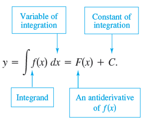
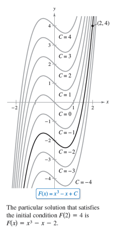

# Integration

Now, we are hitting a point where we really can't avoid this.  Previously, we have introduced the idea of the derivative and shown that

* Velocity $\displaystyle v = \frac{dx}{dt}$
* Acceleration $\displaystyle a = \frac{dv}{dt} = \frac{d^2x}{dt^2}$

How might we be able to go *backwards*?  Specifically, how do we undo "differentiation"?  As it were, this is the heart of *integration*.  Here, we are focusing on the skills we absolutely need for kinematics for now, and will add to those skills as needed.  What we are doing is scattered/summarized from Larson, *Calculus*, Ch. 4.1-3.

## Antiderivatives

> An antiderivative of function $f(x)$ is a function $F(x)$ for which $F^\prime (x) = f(x)$. 

So, let's start with (say) the function $f(x) = 2x$.   If I define $g(x) = x^2$, then $g^\prime (x) = 2x$.
* Therefore, $g(x) = x^2$ is an antiderivative of $f(x) = 2x$.

* However, is this the only antiderivative?  No.  If I have $g(x) = x^2 + 5$, then $g^\prime (x) = 2x$ still.  

Generalizing, the class of antiderivatives of $f(x)$ is $g(x) = x^2 + C$ where $C$ is a constant, called the *constant of integration*.  In this case, $g(x) = x^2 + C$ is the *general antiderivative* of $f(x).

### Differential Equations

A differential equation is one that is written in terms of a derivative.  For example, looking at the above, we have seen that

$\displaystyle \frac{dg(x)}{dx} = 2x$

This relationship is written in terms of the derivative of something.  Equations like these are called *differential equations* and are ubiquitous in physics.  For example, if the acceleration of a particle is $a$, then the velocity is given by the differential equation

$\displaystyle \frac{dv_x}{dt} = a$

Note that differential equations might be written in terms of second derivatives (these would be *second-order* differential equations). For example, simple harmonic motion is described by the second order differential equation

$\displaystyle \frac{d^2 x}{dt^2} = - \omega^2 x$

The *solution* of a differential equation is found when the function in the derivative is found.

> #### Example
>
> For the differential equation $\displaystyle \frac{dg(x)}{dx} = 2x$, since we know that the general form of $g(x)$ is given by
>
> $g(x) = x^2 + C$
>
> then the above is the general solution of the differential equation.

### From Antiderivatives to Indefinite Integrals

Let's consider a general first-order differential equation

$\displaystyle \frac{dy}{dx} = f(x)$

As you may recall from algebra, the key to using formulae and solving equations is to separate variables onto the two sides of equations.  We generalize this a bit by including the $dx$ part with the $x$ part, and similarly with $y$ (or any other variable).  Multiplying both sides by $dx$, we get

$dy = f(x) dx$

*Indefinite integration* is the process for finding antiderivatives[^1] In general, we put an *integral sign* to represent this operation

$\int f(x) dx$ is the *indefinite integral*[^2]

* A key point is that integration is the *inverse* of differentiation, while differentiation is the *inverse* of integration, so $\displaystyle \frac{d}{dx} \left[ \int f(x) dx \right] = f(x)$.

## Finding Antiderivatives

Since we know that derivatives are the reverse of integrals, we can simply reverse the derivatives we work with.

### Polynomials

We can start with the following

* We can add together the integrals of each term:

  $\displaystyle \int \left[f(x) + g(x)\right] dx = \int f(x) dx + \int g(x) dx$.

* If you multtiply some function by a constant, then we just get the integral multiplied by that constant:

  $\displaystyle \int (af(x)) dx = a \int f(x) dx$.

* Reversing the standard expression $\displaystyle \frac{df(x)}{dx} = x^n = nx^{n-1}$, naively we see that $\displaystyle \int x^n dx = \frac{x^{n+1}}{n+1} + C$

  * Don't forget to put in the constant of integration $C$ every time you have an indefinite integral (we will address this issue later).
  * However, if you think about the case $n=-1$ (to find $\displaystyle \int \frac{1}{x}dx$), applying this rule would mean that the integral of the function $\displaystyle \frac{1}{x}$ is undefined (which doesn't make sense).   In this case, it can be shown that $\displaystyle \int \frac{1}{x} dx = \ln x + C$.
    * Aside: Yes, it also means that $\displaystyle \frac{d}{dx} [\ln x] = \frac{1}{x}$

> #### Example
>
> Find $\displaystyle \left(\sqrt{x} + \frac{2}{\sqrt{x}}\right)dx$
>
> 

Answer
<math display="block" class="tml-display" style="display:block math;"><mstyle scriptlevel="0" displaystyle="true"><mtable displaystyle="true" columnalign="right left" class="tml-jot"><mtr><mtd class="tml-right" style="padding-left:0em;padding-right:0em;"><mrow><mo movablelimits="false">∫</mo><mrow><mo fence="true" form="prefix">(</mo><msqrt><mi>x</mi></msqrt><mo>+</mo><mfrac><mn>2</mn><msqrt><mi>x</mi></msqrt></mfrac><mo fence="true" form="postfix">)</mo></mrow><mi>d</mi><mi>x</mi></mrow></mtd><mtd class="tml-left" style="padding-left:0em;padding-right:0em;"><mrow><mo>=</mo><mo movablelimits="false">∫</mo><msqrt><mi>x</mi></msqrt><mi>d</mi><mi>x</mi><mo>+</mo><mo movablelimits="false">∫</mo><mfrac><mn>2</mn><msqrt><mi>x</mi></msqrt></mfrac><mi>d</mi><mi>x</mi></mrow></mtd></mtr><mtr><mtd class="tml-right" style="padding-left:0em;padding-right:0em;"><mrow></mrow></mtd><mtd class="tml-left" style="padding-left:0em;padding-right:0em;"><mrow><mo>=</mo><mo movablelimits="false">∫</mo><msup><mi>x</mi><mrow class="tml-sml-pad"><mn>1</mn><mi>/</mi><mn>2</mn></mrow></msup><mi>d</mi><mi>x</mi><mo>+</mo><mn>2</mn><mo movablelimits="false">∫</mo><msup><mi>x</mi><mrow class="tml-sml-pad"><mo lspace="0em" rspace="0em">−</mo><mn>1</mn><mi>/</mi><mn>2</mn></mrow></msup><mi>d</mi><mi>x</mi></mrow></mtd></mtr><mtr><mtd class="tml-right" style="padding-left:0em;padding-right:0em;"><mrow></mrow></mtd><mtd class="tml-left" style="padding-left:0em;padding-right:0em;"><mrow><mo>=</mo><mfrac><msup><mi>x</mi><mrow class="tml-sml-pad"><mn>3</mn><mi>/</mi><mn>2</mn></mrow></msup><mrow><mn>3</mn><mi>/</mi><mn>2</mn></mrow></mfrac><mo>+</mo><mn>2</mn><mrow><mo fence="true" form="prefix">(</mo><mfrac><msup><mi>x</mi><mrow class="tml-sml-pad"><mn>1</mn><mi>/</mi><mn>2</mn></mrow></msup><mrow><mn>1</mn><mi>/</mi><mn>2</mn></mrow></mfrac><mo fence="true" form="postfix">)</mo></mrow><mo>+</mo><mi>C</mi></mrow></mtd></mtr><mtr><mtd class="tml-right" style="padding-left:0em;padding-right:0em;"><mrow></mrow></mtd><mtd class="tml-left" style="padding-left:0em;padding-right:0em;"><mrow><mo>=</mo><mfrac><mn>2</mn><mn>3</mn></mfrac><mi>x</mi><msqrt><mi>x</mi></msqrt><mo>+</mo><mn>4</mn><msqrt><mi>x</mi></msqrt><mo>+</mo><mi>C</mi></mrow></mtd></mtr></mtable></mstyle></math>
> 

> #### Class Question
>
> Find $\int (9x^2 + 6x)dx$
>
> 

Answer
<math display="block" class="tml-display" style="display:block math;"><mstyle scriptlevel="0" displaystyle="true"><mtable displaystyle="true" columnalign="right left" class="tml-jot"><mtr><mtd class="tml-right" style="padding-left:0em;padding-right:0em;"><mrow><mo movablelimits="false">∫</mo><mo form="prefix" stretchy="false">(</mo><mn>9</mn><msup><mi>x</mi><mn class="tml-sml-pad">2</mn></msup><mo>+</mo><mn>6</mn><mi>x</mi><mo form="postfix" stretchy="false">)</mo><mi>d</mi><mi>x</mi></mrow></mtd><mtd class="tml-left" style="padding-left:0em;padding-right:0em;"><mrow><mo>=</mo><mn>9</mn><mo movablelimits="false">∫</mo><msup><mi>x</mi><mn class="tml-sml-pad">2</mn></msup><mi>d</mi><mi>x</mi><mo>+</mo><mn>6</mn><mo movablelimits="false">∫</mo><mi>x</mi><mi>d</mi><mi>x</mi></mrow></mtd></mtr><mtr><mtd class="tml-right" style="padding-left:0em;padding-right:0em;"><mrow></mrow></mtd><mtd class="tml-left" style="padding-left:0em;padding-right:0em;"><mrow><mo>=</mo><mn>9</mn><mrow><mo fence="true" form="prefix">(</mo><mfrac><msup><mi>x</mi><mn class="tml-sml-pad">3</mn></msup><mn>3</mn></mfrac><mo fence="true" form="postfix">)</mo></mrow><mo>+</mo><mn>6</mn><mrow><mo fence="true" form="prefix">(</mo><mfrac><msup><mi>x</mi><mn class="tml-sml-pad">2</mn></msup><mn>2</mn></mfrac><mo fence="true" form="postfix">)</mo></mrow><mo>+</mo><mi>C</mi></mrow></mtd></mtr><mtr><mtd class="tml-right" style="padding-left:0em;padding-right:0em;"><mrow></mrow></mtd><mtd class="tml-left" style="padding-left:0em;padding-right:0em;"><mrow><mo>=</mo><mn>3</mn><msup><mi>x</mi><mn class="tml-sml-pad">3</mn></msup><mo>+</mo><mn>3</mn><msup><mi>x</mi><mn class="tml-sml-pad">2</mn></msup><mo>+</mo><mi>C</mi></mrow></mtd></mtr></mtable></mstyle></math>

### Trigonometric Functions

Again, based on what we have learnt about derivatives,

* $\displaystyle \int (\cos x) dx = \sin x$
* $\displaystyle \int (\sin x)dx = -\cos x$

Recall that here $x$ should be in *radians*.

### Integration by Substitution

If we have a case where we can simplify out an integral by rewriting it in terms of some function $u(x)$, then[^3]

* Define $u(x)$
* Find $\displaystyle \frac{du}{dx}$ and rearrange it to find an expression for $dx$ in terms of $du$.
* Rewrite $\displaystyle \int f(x) dx$
  * Rewrite $f(x)$ to $f(u)$
  * Substitute in the expression for $dx$.
* Solve accordingly

> #### Example
>
> Solve $\displaystyle \int \frac{\sin \theta}{\cos^2 \theta} d\theta$
>
> 

Answer
We substitute <math><mrow><mi>u</mi><mo>=</mo></mrow><mrow><mrow><mi>cos</mi><mo>⁡</mo><mspace width="0.1667em"></mspace></mrow><mi>θ</mi></mrow></math>.  If so, we find that <math display="block" class="tml-display" style="display:block math;"><mtable displaystyle="true" columnalign="right left" class="tml-jot"><mtr><mtd class="tml-right" style="padding-left:0em;padding-right:0em;"><mfrac><mrow><mi>d</mi><mi>u</mi></mrow><mrow><mi>d</mi><mi>θ</mi></mrow></mfrac></mtd><mtd class="tml-left" style="padding-left:0em;padding-right:0em;"><mrow><mo>=</mo><mo form="prefix" stretchy="false">−</mo><mrow><mi>sin</mi><mo>⁡</mo><mspace width="0.1667em"></mspace></mrow><mi>θ</mi></mrow></mtd></mtr><mtr><mtd class="tml-right" style="padding-left:0em;padding-right:0em;"><mrow><mi>d</mi><mi>θ</mi></mrow></mtd><mtd class="tml-left" style="padding-left:0em;padding-right:0em;"><mrow><mo>=</mo><mo form="prefix" stretchy="false">−</mo><mfrac><mrow><mi>d</mi><mi>u</mi></mrow><mrow><mrow><mi>sin</mi><mo>⁡</mo><mspace width="0.1667em"></mspace></mrow><mi>θ</mi></mrow></mfrac></mrow></mtd></mtr></mtable></math>  Given this, we can rewrite the integral as <math display="block" class="tml-display" style="display:block math;"><mtable displaystyle="true" columnalign="right left" class="tml-jot"><mtr><mtd class="tml-right" style="padding-left:0em;padding-right:0em;"><mrow><mo movablelimits="false">∫</mo><mfrac><mrow><mrow><mi>sin</mi><mo>⁡</mo><mspace width="0.1667em"></mspace></mrow><mi>θ</mi></mrow><mrow><msup><mi>cos</mi><mn>2</mn></msup><mo>⁡</mo><mspace width="0.1667em"></mspace><mi>θ</mi></mrow></mfrac><mi>d</mi><mi>θ</mi></mrow></mtd><mtd class="tml-left" style="padding-left:0em;padding-right:0em;"><mrow><mo>=</mo><mo movablelimits="false">∫</mo><mfrac><mrow><mrow><mi>sin</mi><mo>⁡</mo><mspace width="0.1667em"></mspace></mrow><mi>θ</mi></mrow><msup><mi>u</mi><mn class="tml-sml-pad">2</mn></msup></mfrac><mo>⋅</mo><mrow><mo fence="true" form="prefix">(</mo><mo>−</mo><mfrac><mrow><mi>d</mi><mi>u</mi></mrow><mrow><mrow><mi>sin</mi><mo>⁡</mo><mspace width="0.1667em"></mspace></mrow><mi>θ</mi></mrow></mfrac><mo fence="true" form="postfix">)</mo></mrow></mrow></mtd></mtr><mtr><mtd class="tml-right" style="padding-left:0em;padding-right:0em;"><mrow></mrow></mtd><mtd class="tml-left" style="padding-left:0em;padding-right:0em;"><mrow><mo>=</mo><mo form="prefix" stretchy="false">−</mo><mo movablelimits="false">∫</mo><mfrac><mrow><mi>d</mi><mi>u</mi></mrow><msup><mi>u</mi><mn class="tml-sml-pad">2</mn></msup></mfrac></mrow></mtd></mtr><mtr><mtd class="tml-right" style="padding-left:0em;padding-right:0em;"><mrow></mrow></mtd><mtd class="tml-left" style="padding-left:0em;padding-right:0em;"><mrow><mo>=</mo><mo form="prefix" stretchy="false">−</mo><mfrac><msup><mi>u</mi><mrow class="tml-sml-pad"><mo lspace="0em" rspace="0em">−</mo><mn>1</mn></mrow></msup><mrow><mo lspace="0em" rspace="0em">−</mo><mn>1</mn></mrow></mfrac><mo>+</mo><mi>C</mi></mrow></mtd></mtr><mtr><mtd class="tml-right" style="padding-left:0em;padding-right:0em;"><mrow></mrow></mtd><mtd class="tml-left" style="padding-left:0em;padding-right:0em;"><mrow><mo>=</mo><mfrac><mn>1</mn><mrow><mrow><mi>cos</mi><mo>⁡</mo><mspace width="0.1667em"></mspace></mrow><mi>θ</mi></mrow></mfrac><mo>+</mo><mi>C</mi></mrow></mtd></mtr></mtable></math>

> #### Class Question
>
> Find the indefinite integral $\displaystyle \int (1+5u)^2 du$
>
> 

Answer
We substitute <math><mrow><mi>y</mi><mo>=</mo></mrow><mrow><mn>1</mn><mo>+</mo></mrow><mrow><mn>5</mn><mi>u</mi></mrow></math> and then:<math display="block" class="tml-display" style="display:block math;"><mtable displaystyle="true" columnalign="right left" class="tml-jot"><mtr><mtd class="tml-right" style="padding-left:0em;padding-right:0em;"><mfrac><mrow><mi>d</mi><mi>y</mi></mrow><mrow><mi>d</mi><mi>u</mi></mrow></mfrac></mtd><mtd class="tml-left" style="padding-left:0em;padding-right:0em;"><mrow><mo>=</mo><mn>5</mn></mrow></mtd></mtr><mtr><mtd class="tml-right" style="padding-left:0em;padding-right:0em;"><mrow><mi>d</mi><mi>u</mi></mrow></mtd><mtd class="tml-left" style="padding-left:0em;padding-right:0em;"><mrow><mo>=</mo><mfrac><mrow><mi>d</mi><mi>y</mi></mrow><mn>5</mn></mfrac></mrow></mtd></mtr><mtr><mtd class="tml-right" style="padding-left:0em;padding-right:0em;"><mrow><mo movablelimits="false">∫</mo><mo form="prefix" stretchy="false">(</mo><mn>1</mn><mo>+</mo><mn>5</mn><mi>u</mi><msup><mo form="postfix" stretchy="false">)</mo><mn>2</mn></msup><mi>d</mi><mi>u</mi></mrow></mtd><mtd class="tml-left" style="padding-left:0em;padding-right:0em;"><mrow><mo>=</mo><mo movablelimits="false">∫</mo><msup><mi>y</mi><mn class="tml-sml-pad">2</mn></msup><mo>⋅</mo><mfrac><mrow><mi>d</mi><mi>y</mi></mrow><mn>5</mn></mfrac></mrow></mtd></mtr><mtr><mtd class="tml-right" style="padding-left:0em;padding-right:0em;"><mrow></mrow></mtd><mtd class="tml-left" style="padding-left:0em;padding-right:0em;"><mrow><mo>=</mo><mfrac><mn>1</mn><mn>5</mn></mfrac><mo movablelimits="false">∫</mo><msup><mi>y</mi><mn class="tml-sml-pad">2</mn></msup><mi>d</mi><mi>y</mi></mrow></mtd></mtr><mtr><mtd class="tml-right" style="padding-left:0em;padding-right:0em;"><mrow></mrow></mtd><mtd class="tml-left" style="padding-left:0em;padding-right:0em;"><mrow><mo>=</mo><mfrac><mn>1</mn><mn>5</mn></mfrac><mfrac><msup><mi>y</mi><mn class="tml-sml-pad">3</mn></msup><mn>3</mn></mfrac><mo>+</mo><mi>C</mi></mrow></mtd></mtr><mtr><mtd class="tml-right" style="padding-left:0em;padding-right:0em;"><mrow></mrow></mtd><mtd class="tml-left" style="padding-left:0em;padding-right:0em;"><mrow><mo>=</mo><mfrac><mn>1</mn><mn>15</mn></mfrac><mo form="prefix" stretchy="false">(</mo><mn>1</mn><mo>+</mo><mn>5</mn><mi>u</mi><msup><mo form="postfix" stretchy="false">)</mo><mn>3</mn></msup></mrow></mtd></mtr></mtable></math>

## Beyond the Shadow of the Constant of Integration: Getting a Particular Solution

So far, we've figured out how to solve an integral.  But we've left a very inglorious constant of integration $C$ in our integrals, which means *gasp* you can't shove numbers through a calculator.  There are two ways that this might get resolved, both of which are important in calculus.

For indefinite integrals, let's consider the case

$\displaystyle y = \int (3x^2 + 1) dx = x^3 - x+C$

which would yield this set of values that vary in the specific $y$-intercept

(Larson, *Calculus*)

To find a particular value of $C$, you need to be given the value of the integral for *one* value of $x$.  This information is called the *initial condition*[^4].  The *particular solution* you are seeking can be found by

* Solve for the indefinite integral.
* Substitute the value of the variables given for the *initial conditions*, and solve for $C$.
* This value of $C$ would be true for this problem.

>  ### Example
>
> Find the particular solution for $y(x)$ given that $\displaystyle \frac{dy}{dx} = 2(x-1)$ and the curve goes through $(3,2)$.
>
> 

Answer
<math display="block" class="tml-display" style="display:block math;"><mtable displaystyle="true" columnalign="right left" class="tml-jot"><mtr><mtd class="tml-right" style="padding-left:0em;padding-right:0em;"><mi>y</mi></mtd><mtd class="tml-left" style="padding-left:0em;padding-right:0em;"><mrow><mo>=</mo><mn>2</mn><mo movablelimits="false">∫</mo><mo form="prefix" stretchy="false">(</mo><mi>x</mi><mo>−</mo><mn>1</mn><mo form="postfix" stretchy="false">)</mo><mi>d</mi><mi>x</mi></mrow></mtd></mtr><mtr><mtd class="tml-right" style="padding-left:0em;padding-right:0em;"><mrow></mrow></mtd><mtd class="tml-left" style="padding-left:0em;padding-right:0em;"><mrow><mo>=</mo><mn>2</mn><mrow><mo fence="true" form="prefix">(</mo><mo movablelimits="false">∫</mo><mi>x</mi><mo>⋅</mo><mi>d</mi><mi>x</mi><mo>−</mo><mo movablelimits="false">∫</mo><mi>d</mi><mi>x</mi><mo fence="true" form="postfix">)</mo></mrow></mrow></mtd></mtr><mtr><mtd class="tml-right" style="padding-left:0em;padding-right:0em;"><mrow></mrow></mtd><mtd class="tml-left" style="padding-left:0em;padding-right:0em;"><mrow><mo>=</mo><mn>2</mn><mrow><mo fence="true" form="prefix">(</mo><mfrac><msup><mi>x</mi><mn class="tml-sml-pad">2</mn></msup><mn>2</mn></mfrac><mo>−</mo><mi>x</mi><mo fence="true" form="postfix">)</mo></mrow><mo>+</mo><mi>C</mi></mrow></mtd></mtr></mtable></math>.  Now, substitute in $x=3,y=2$ into this equation,<math display="block" class="tml-display" style="display:block math;"><mtable displaystyle="true" columnalign="right left" class="tml-jot"><mtr><mtd class="tml-right" style="padding-left:0em;padding-right:0em;"><mi>y</mi></mtd><mtd class="tml-left" style="padding-left:0em;padding-right:0em;"><mrow><mo>=</mo><msup><mi>x</mi><mn class="tml-sml-pad">2</mn></msup><mo>−</mo><mn>2</mn><mi>x</mi><mo>+</mo><mi>C</mi></mrow></mtd></mtr><mtr><mtd class="tml-right" style="padding-left:0em;padding-right:0em;"><mrow><mo form="prefix" stretchy="false">(</mo><mn>2</mn><mo form="postfix" stretchy="false">)</mo></mrow></mtd><mtd class="tml-left" style="padding-left:0em;padding-right:0em;"><mrow><mo>=</mo><mo form="prefix" stretchy="false">(</mo><mn>3</mn><msup><mo form="postfix" stretchy="false">)</mo><mn>2</mn></msup><mo>−</mo><mn>2</mn><mo form="prefix" stretchy="false">(</mo><mn>3</mn><mo form="postfix" stretchy="false">)</mo><mo>+</mo><mi>C</mi></mrow></mtd></mtr><mtr><mtd class="tml-right" style="padding-left:0em;padding-right:0em;"><mrow></mrow></mtd><mtd class="tml-left" style="padding-left:0em;padding-right:0em;"><mrow><mo>=</mo><mn>3</mn><mo>+</mo><mi>C</mi></mrow></mtd></mtr><mtr><mtd class="tml-right" style="padding-left:0em;padding-right:0em;"><mi>C</mi></mtd><mtd class="tml-left" style="padding-left:0em;padding-right:0em;"><mrow><mo>=</mo><mo form="prefix" stretchy="false">−</mo><mn>1</mn></mrow></mtd></mtr></mtable></math>
>  and therefore <math display="block" class="tml-display" style="display:block math;"><mrow><mi>y</mi><mo>=</mo><msup><mi>x</mi><mn class="tml-sml-pad">2</mn></msup><mo>−</mo><mn>2</mn><mi>x</mi><mo>−</mo><mn>1</mn></mrow></math>

> ### Class Question
>
> An evergreen nursery usually sells a certain shrub after 6 years of growth and shaping. The growth rate during those 6 years is approximated by $\displaystyle \frac{dh}{dt} = 3.5t+5$, where *t* is the time in years and *h* is the height in centimeters. The seedlings are 13 centimeters tall when planted (*t* = 0). Find the height after *t* years.
>
> *Hint: rearrange it so that all $t$ and $dt$ terms are on one side.*
>
> 

Answer
<math display="block" class="tml-display" style="display:block math;"><mtable displaystyle="true" columnalign="right left" class="tml-jot"><mtr><mtd class="tml-right" style="padding-left:0em;padding-right:0em;"><mfrac><mrow><mi>d</mi><mi>h</mi></mrow><mrow><mi>d</mi><mi>t</mi></mrow></mfrac></mtd><mtd class="tml-left" style="padding-left:0em;padding-right:0em;"><mrow><mo>=</mo><mn>3.5</mn><mi>t</mi><mo>+</mo><mn>5</mn></mrow></mtd></mtr><mtr><mtd class="tml-right" style="padding-left:0em;padding-right:0em;"><mrow><mo movablelimits="false">∫</mo><mi>d</mi><mi>h</mi></mrow></mtd><mtd class="tml-left" style="padding-left:0em;padding-right:0em;"><mrow><mo>=</mo><mo movablelimits="false">∫</mo><mo form="prefix" stretchy="false">(</mo><mn>3.5</mn><mi>t</mi><mo>+</mo><mn>5</mn><mo form="postfix" stretchy="false">)</mo><mi>d</mi><mi>t</mi></mrow></mtd></mtr><mtr><mtd class="tml-right" style="padding-left:0em;padding-right:0em;"><mi>h</mi></mtd><mtd class="tml-left" style="padding-left:0em;padding-right:0em;"><mrow><mo>=</mo><mn>3.5</mn><mrow><mo fence="true" form="prefix">(</mo><mfrac><msup><mi>t</mi><mn class="tml-med-pad">2</mn></msup><mn>2</mn></mfrac><mo fence="true" form="postfix">)</mo></mrow><mo>+</mo><mn>5</mn><mi>t</mi><mo>+</mo><mi>C</mi></mrow></mtd></mtr></mtable></math> and therefore, substituting in <i>t</i> =0 and <i>h</i>=13, <math display="block" class="tml-display" style="display:block math;"><mtable displaystyle="true" columnalign="right left" class="tml-jot"><mtr><mtd class="tml-right" style="padding-left:0em;padding-right:0em;"><mi>h</mi></mtd><mtd class="tml-left" style="padding-left:0em;padding-right:0em;"><mrow><mo>=</mo><mn>3.5</mn><mrow><mo fence="true" form="prefix">(</mo><mfrac><msup><mi>t</mi><mn class="tml-med-pad">2</mn></msup><mn>2</mn></mfrac><mo fence="true" form="postfix">)</mo></mrow><mo>+</mo><mn>5</mn><mi>t</mi><mo>+</mo><mi>C</mi></mrow></mtd></mtr><mtr><mtd class="tml-right" style="padding-left:0em;padding-right:0em;"><mrow></mrow></mtd><mtd class="tml-left" style="padding-left:0em;padding-right:0em;"><mrow><mo>=</mo><mn>1.75</mn><msup><mi>t</mi><mn class="tml-med-pad">2</mn></msup><mo>+</mo><mn>5</mn><mi>t</mi><mo>+</mo><mi>C</mi></mrow></mtd></mtr><mtr><mtd class="tml-right" style="padding-left:0em;padding-right:0em;"><mrow><mo form="prefix" stretchy="false">(</mo><mn>13</mn><mo form="postfix" stretchy="false">)</mo></mrow></mtd><mtd class="tml-left" style="padding-left:0em;padding-right:0em;"><mrow><mo>=</mo><mn>1.75</mn><mo form="prefix" stretchy="false">(</mo><mn>0</mn><msup><mo form="postfix" stretchy="false">)</mo><mn>2</mn></msup><mo>+</mo><mn>5</mn><mo form="prefix" stretchy="false">(</mo><mn>0</mn><mo form="postfix" stretchy="false">)</mo><mo>+</mo><mi>C</mi></mrow></mtd></mtr><mtr><mtd class="tml-right" style="padding-left:0em;padding-right:0em;"><mi>C</mi></mtd><mtd class="tml-left" style="padding-left:0em;padding-right:0em;"><mrow><mo>=</mo><mn>13</mn></mrow></mtd></mtr></mtable></math>.  Therefore, <math display="block" class="tml-display" style="display:block math;"><mrow><mi>h</mi><mo form="prefix" stretchy="false">(</mo><mi>t</mi><mo form="postfix" stretchy="false">)</mo><mo>=</mo><mn>1.75</mn><msup><mi>t</mi><mn class="tml-med-pad">2</mn></msup><mo>+</mo><mn>5</mn><mi>t</mi><mo>+</mo><mn>13</mn></mrow></math>

### Application: Schrodinger's Equation

*This is kept here to motivate the topic and will not be examined or assumed in future exams for this course*

This might seem completely picayune, but as it were there are significant applications.  As you may know, the wavefunction for a particle in quantum mechanics (which determines its probability distribution) is the solution to

$\displaystyle \frac{d^2 \psi}{dx^2}+ V(x)\psi = E\psi$

Yes, every time-independent quantum mechanical problem is (in principle) the solution to this equation (expanded to 3D) - electrons in atoms, electrons in molecules, particle in a box, quantum tunnelling.  The difference in *each* type of problem are:

* What is the function for $V(x)$
* The *initial conditions* for the particular problem.

## Area Under a Curve: Definite Integrals

If differentiation is finding the *slope* of the function, what is the physical reality of the integral?  As it were, it can be shown that the integral is the *net signed area* under a curve between the limits of the function.  For instance, for the function $f(x) = x-2$, the definite integral between $x=2$ and $x=6$, written out as

$\displaystyle \int_2^6 (x-2) dx$

is the area $A_1$ - the area under the curve between $x=2$ and $x=6$. 

Note that I mentioned the word *signed*.  This means that if the area is, in fact, under the $x$-axis, then it would be the negative of the area.  In this case, for example,

$\displaystyle \int_0^6 (x-2)dx = A_1 - A_2$

The concept of this being the *area under the curve* is a critical one and will become important.

> ### Example
>
> The area under the velocity-time graph between $t_0$ and $t_f$ is the displacement between time $t_0$ and $t_f$.

To evaluate this

* find the antiderivative.  Do *not* include the constant of integration

* If $F(x)$ is the antiderivative of $f(x)$ and the limits are $x_i$ and $x_f$, then

  $\displaystyle \int_{x_i}^{x_f} f(x) dx = F(x_f) - F(x_i)$

  in other words, the final value of the antiderivative minus the initial value of the antiderivative.

> ### Example
>
> Find $\displaystyle \int_0^1 2\sin \pi x \cdot \mbox{d}x$
>
> 

Hint
Making the substitution <math><mrow><mi>u</mi><mo>=</mo></mrow><mrow><mi>π</mi><mi>x</mi></mrow></math>
> , I would then need to
>     <ul>
>         <li>Find dx in terms of du</li>
>         <li>Express the integral in terms of u</li>
>         <li>Change the limits of the integral to express it as values of u</li>
>         <li>Solve it as before to find the integral</li>
>         <li>Substitute in the limits and find the difference.</li>
>     </ul>
>     Here's how we do it
> 

>
> 

Answer
Making the substitution <math><mrow><mi>u</mi><mo>=</mo></mrow><mrow><mi>π</mi><mi>x</mi></mrow></math>, we get
>     <math display="block" class="tml-display" style="display:block math;"><mtable displaystyle="true" columnalign="right left" class="tml-jot"><mtr><mtd class="tml-right" style="padding-left:0em;padding-right:0em;"><mi>u</mi></mtd><mtd class="tml-left" style="padding-left:0em;padding-right:0em;"><mrow><mo>=</mo><mi>π</mi><mi>x</mi></mrow></mtd></mtr><mtr><mtd class="tml-right" style="padding-left:0em;padding-right:0em;"><mfrac><mrow><mi>d</mi><mi>u</mi></mrow><mrow><mi>d</mi><mi>x</mi></mrow></mfrac></mtd><mtd class="tml-left" style="padding-left:0em;padding-right:0em;"><mrow><mo>=</mo><mi>π</mi></mrow></mtd></mtr><mtr><mtd class="tml-right" style="padding-left:0em;padding-right:0em;"><mrow><mi>d</mi><mi>x</mi></mrow></mtd><mtd class="tml-left" style="padding-left:0em;padding-right:0em;"><mrow><mo>=</mo><mfrac><mrow><mi>d</mi><mi>u</mi></mrow><mi>π</mi></mfrac></mrow></mtd></mtr></mtable></math>
>     and since if x=0, u=0 and if x=1, u=π, we get<math display="block" class="tml-display" style="display:block math;"><mtable displaystyle="true" columnalign="right left" class="tml-jot"><mtr><mtd class="tml-right" style="padding-left:0em;padding-right:0em;"><mrow><msubsup><mo movablelimits="false">∫</mo><mrow><mi>x</mi><mo>=</mo><mn>0</mn></mrow><mn>1</mn></msubsup><mn>2</mn><mrow><mspace width="0.1667em"></mspace><mi>sin</mi><mo>⁡</mo><mspace width="0.1667em"></mspace></mrow><mi>π</mi><mi>x</mi><mo>⋅</mo><mi>d</mi><mi>x</mi></mrow></mtd><mtd class="tml-left" style="padding-left:0em;padding-right:0em;"><mrow><mo>=</mo><mn>2</mn><msubsup><mo movablelimits="false">∫</mo><mrow><mi>u</mi><mo>=</mo><mn>0</mn></mrow><mi>π</mi></msubsup><mrow><mi>sin</mi><mo>⁡</mo><mspace width="0.1667em"></mspace></mrow><mi>u</mi><mo>⋅</mo><mfrac><mrow><mi>d</mi><mi>u</mi></mrow><mi>π</mi></mfrac></mrow></mtd></mtr><mtr><mtd class="tml-right" style="padding-left:0em;padding-right:0em;"><mrow></mrow></mtd><mtd class="tml-left" style="padding-left:0em;padding-right:0em;"><mrow><mo>=</mo><mfrac><mn>2</mn><mi>π</mi></mfrac><msubsup><mrow><mo fence="true" form="prefix">[</mo><mo>−</mo><mrow><mi>cos</mi><mo>⁡</mo><mspace width="0.1667em"></mspace></mrow><mi>u</mi><mo fence="true" form="postfix">]</mo></mrow><mn>0</mn><mi>π</mi></msubsup></mrow></mtd></mtr><mtr><mtd class="tml-right" style="padding-left:0em;padding-right:0em;"><mrow></mrow></mtd><mtd class="tml-left" style="padding-left:0em;padding-right:0em;"><mrow><mo>=</mo><mo form="prefix" stretchy="false">−</mo><mfrac><mn>2</mn><mi>π</mi></mfrac><mrow><mo fence="true" form="prefix">[</mo><mo form="prefix" stretchy="false">(</mo><mrow><mi>cos</mi><mo>⁡</mo><mspace width="0.1667em"></mspace></mrow><mi>π</mi><mo form="postfix" stretchy="false">)</mo><mo>−</mo><mo form="prefix" stretchy="false">(</mo><mrow><mi>cos</mi><mo>⁡</mo><mspace width="0.1667em"></mspace></mrow><mn>0</mn><mo form="postfix" stretchy="false">)</mo><mo fence="true" form="postfix">]</mo></mrow></mrow></mtd></mtr><mtr><mtd class="tml-right" style="padding-left:0em;padding-right:0em;"><mrow></mrow></mtd><mtd class="tml-left" style="padding-left:0em;padding-right:0em;"><mrow><mo>=</mo><mo form="prefix" stretchy="false">−</mo><mfrac><mn>2</mn><mi>π</mi></mfrac><mrow><mo fence="true" form="prefix">[</mo><mo form="prefix" stretchy="false">(</mo><mo form="prefix" stretchy="false">−</mo><mn>1</mn><mo form="postfix" stretchy="false">)</mo><mo>−</mo><mo form="prefix" stretchy="false">(</mo><mn>1</mn><mo form="postfix" stretchy="false">)</mo><mo fence="true" form="postfix">]</mo></mrow></mrow></mtd></mtr><mtr><mtd class="tml-right" style="padding-left:0em;padding-right:0em;"><mrow></mrow></mtd><mtd class="tml-left" style="padding-left:0em;padding-right:0em;"><mrow><mo>=</mo><mfrac><mn>4</mn><mi>π</mi></mfrac></mrow></mtd></mtr></mtable></math>

> ### Class Question
>
> Find $\displaystyle \int_5^{10} (-3t^2)dt$
>
> 

Answer
<math display="block" class="tml-display" style="display:block math;"><mtable displaystyle="true" columnalign="right left" class="tml-jot"><mtr><mtd class="tml-right" style="padding-left:0em;padding-right:0em;"><mrow><msubsup><mo movablelimits="false">∫</mo><mn>5</mn><mn>10</mn></msubsup><mo form="prefix" stretchy="false">(</mo><mo form="prefix" stretchy="false">−</mo><mn>3</mn><msup><mi>t</mi><mn class="tml-med-pad">2</mn></msup><mo form="postfix" stretchy="false">)</mo><mi>d</mi><mi>t</mi></mrow></mtd><mtd class="tml-left" style="padding-left:0em;padding-right:0em;"><mrow><mo>=</mo><mo form="prefix" stretchy="false">−</mo><mn>3</mn><msubsup><mrow><mo fence="true" form="prefix">[</mo><mfrac><msup><mi>t</mi><mn class="tml-med-pad">3</mn></msup><mn>3</mn></mfrac><mo fence="true" form="postfix">]</mo></mrow><mn>5</mn><mn>10</mn></msubsup></mrow></mtd></mtr><mtr><mtd class="tml-right" style="padding-left:0em;padding-right:0em;"><mrow></mrow></mtd><mtd class="tml-left" style="padding-left:0em;padding-right:0em;"><mrow><mo>=</mo><mo form="prefix" stretchy="false">−</mo><msubsup><mrow><mo fence="true" form="prefix">[</mo><msup><mi>t</mi><mn class="tml-med-pad">3</mn></msup><mo fence="true" form="postfix">]</mo></mrow><mn>5</mn><mn>10</mn></msubsup></mrow></mtd></mtr><mtr><mtd class="tml-right" style="padding-left:0em;padding-right:0em;"><mrow></mrow></mtd><mtd class="tml-left" style="padding-left:0em;padding-right:0em;"><mrow><mo>=</mo><mo form="prefix" stretchy="false">−</mo><mo form="prefix" stretchy="false">(</mo><msup><mn>10</mn><mn>3</mn></msup><mo>−</mo><msup><mn>5</mn><mn>3</mn></msup><mo form="postfix" stretchy="false">)</mo></mrow></mtd></mtr><mtr><mtd class="tml-right" style="padding-left:0em;padding-right:0em;"><mrow></mrow></mtd><mtd class="tml-left" style="padding-left:0em;padding-right:0em;"><mrow><mo>=</mo><mo form="prefix" stretchy="false">−</mo><mo form="prefix" stretchy="false">(</mo><mn>1000</mn><mo>−</mo><mn>125</mn><mo form="postfix" stretchy="false">)</mo></mrow></mtd></mtr><mtr><mtd class="tml-right" style="padding-left:0em;padding-right:0em;"><mrow></mrow></mtd><mtd class="tml-left" style="padding-left:0em;padding-right:0em;"><mrow><mo>=</mo><mo form="prefix" stretchy="false">−</mo><mn>875</mn></mrow></mtd></mtr></mtable></math>

[^1]: This is also called *antidifferentiation*.
[^2]: Also *antiderivative*
[^3]: Larson, Ch. 4.5, Theorem 4.13 gives a more formal statement of the theorem.  It probably fits the spirit of the example better, but anyway.
[^4]: Many/most books call this a *boundary condition*.
