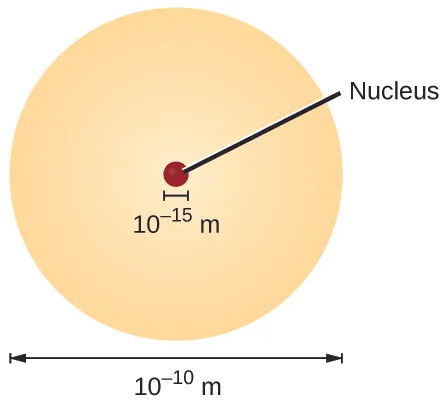

# A.2: Exponents and Radicals

## Exponents
Exponents can be seen as shorthand for "multiply $$n$$ times"

> ### Example
>  $$ a\cdot a \cdot a \cdot a = a^4$$

Similarly, you may recall that negative exponents means *take the reciprocal of*

$$ \displaystyle \frac{1}{a} = a^{-1}$$

### Key Properties of Exponents:

Assuming all numbers are real

1. $$a^m a^n = a^{m+n}$$
2. $$\displaystyle \frac{1}{a^n} = a^{-n}$$
3. $$a^0 = 1$$
4. $$(ab)^m = a^m b^m$$
5. $$(a^m)^n = a^{mn}$$
6. $$|a^2| = |a|^2 = a^2$$

#### Important Distinction

Consider $$(-2)^4$$ versus $$-2^4$$.  These are *different* from each other

* In the first case, we are having $$(-2)^3 = (-2) \times (-2) \times (-2) \times (-2) = 16$$
* In the second case, we have $$-2^4 = -(2\times 2 \times 2 \times 2) = -16$$

Keep track of your brackets carefully!

> ### Example
>
> $$\displaystyle \frac{3^2 \cdot 3}{3^8} = 3^2 \cdot 3^1 \cdot 3^{-8} = 3^{2+1-8} = 3^{-5} = \frac{1}{3^5} = \frac{1}{243}$$

We can work similarly with algebraic expressions

> ### Example
>
> $$\displaystyle \frac{1}{3} (-x)^3 = \frac{1}{3} [-x^3] = -\frac{1}{3} x^3$$. 
>
> If $$x=-3$$ , then we have $$\displaystyle -\frac{1}{3} (-3)^3 = +9$$

> ### Class Question
>
> Simplify $$\displaystyle \frac{36 x^{11}y^{13}}{9x^3 y^9}$$
>
> 

Answer
 4x8y4

### Rewriting Expressions with Positive Exponents

Often it is convenient to express something entirely with positive exponents.  To do this, you have to remember that "minus goes under", so if you move something to the denominator (or vice versa) the exponent changes sign (just like we saw earlier).

> #### Class Question
>
> Rewrite $$\displaystyle \frac{x^7 y^{-8}}{z^{-2}}$$ with positive exponents only.
>
> 

Answer
You would flip both y and z, so that the exponents become positive.  Therefore the answer is (x7z2)/y8

## Scientific Notation

As you may remember from taking chemistry last year, atoms and molecules are tiny such that we are always dealing with large numbers of atoms or molecules.  Each of the following contains a mole of that compound, i.e. 602,214,076,000,000,000,000,000 atoms:

(*OpenStax Chemistry 2e*)

Clearly, this is not a reasonable quantity to work with.  Similarly, we can consider the size of an atom:

Again, it is clear that expressing the diameter as 0.0000000001 m is a pain in the rear (and is hard to read).  The use of exponents allows us to better visualize this number.  In scientific notation, we express the number as

$$\begin{equation} a \times 10^n\end{equation}$$

where $$1 \leq a < 10$$ and $$n$$ is an integer.

> ## Example
>
> Convert 0.0000782 to scientific notation.
>
> 

Answer
The approach to this problem is to move the decimal point to the right or left and count how many times until you have a number that has a units place.  In this case, you moved it to the right five times, so your exponent is -5.  Therefore, the answer is <math>
>   <mrow>
>     <mn>7.82</mn>
>     <mo>×</mo>
>     <msup>
>       <mn>10</mn>
>       <mrow>
>         <mo lspace="0em" rspace="0em">−</mo>
>         <mn>5</mn>
>       </mrow>
>     </msup>
>   </mrow>
> </math>.

> ## Class Exercise
>
> Convert $$4.2 \times 10^3$$ to standard decimal notation
>
> 

Answer
You move the decimal by three places to the right and end up with 4200

# Radicals

As you may recall, the square root of a number is one of two equal factors.  In other words, $$\sqrt{b}$$  is the number $$x$$ where

$$\begin{equation}x^2 = b\end{equation}$$

Furthermore, the $$n$$th root of a number, $$\sqrt[n]{b}$$, is the number $$x$$ that solves the expression $$x^n = b$$

* $$n$$ is the *index* of the radical
* $b$ is the *radicand*.

Note that the square root sign implies *only* the positive root for us in this class unless the negative sign is used.

> ## Example
>
> $\sqrt{4} = 2$, but $\sqrt{4} \neq -2$ even though $(-2)^2 = 4$.  However, if you are asked for $\pm \sqrt{4}$, then the answer is $\pm 2$.

Note that the radicand must be a positive number or zero for there to be a real solution to the radical $\sqrt[n]{b}$.

##  Properties of Radicals

For $a, b$ as real numbers and $m,n$ as positive integers,

1. $\sqrt[n]{a^m} = (\sqrt[n]{a})^m$
2. $\sqrt[n]{a} \cdot \sqrt[n]{b} = \sqrt[n]{ab}$
3. $\displaystyle \frac{\sqrt[n]{a}}{\sqrt[n]{b}} = \sqrt[n]{\frac{a}{b}}$ (assuming $b\neq 0$)
4. $\displaystyle \sqrt[m]{\sqrt[n]{a}} = \sqrt[mn]{a}$
5. $\sqrt[n]{a^n} = |a|$ [^1]

You should be aware that $\sqrt[m]{a} = a^{1/m}$ which would help you simplify radicals.

> ### Example
>
> 1. $\sqrt{12} \cdot \sqrt{3} = \sqrt{12\times 3} = \sqrt{36} = 6$.
> 2. $\sqrt[4]{(3x^2)^4} = 3x^2$

> ### Class Exercise
>
> Find $\sqrt{567x^2}$
>
> 

Answer
To do this problem, it is important that we break down the number 567 into its factors.   By successive division[^2], we can show that 
> <math>
>   <mrow>
>     <mn>567</mn>
>     <mo>=</mo>
>   </mrow>
>   <mrow>
>     <msup>
>       <mn>3</mn>
>       <mn>4</mn>
>     </msup>
>     <mo>×</mo>
>   </mrow>
>   <mrow>
>     <mn>7</mn>
>   </mrow>
> </math> and hence <math display="block" class="tml-display" style="display:block math;"><mrow><msqrt><mrow><mn>567</mn><msup><mi>x</mi><mn class="tml-sml-pad">2</mn></msup></mrow></msqrt><mo>=</mo><msqrt><mn>567</mn></msqrt><mo>⋅</mo><msqrt><msup><mi>x</mi><mn class="tml-sml-pad">2</mn></msup></msqrt><mo>=</mo><msqrt><mrow><msup><mn>3</mn><mn>4</mn></msup><mo>×</mo><mn>7</mn></mrow></msqrt><mo>⋅</mo><mi>x</mi><mo>=</mo><msqrt><msup><mn>3</mn><mn>4</mn></msup></msqrt><mo>⋅</mo><msqrt><mn>7</mn></msqrt><mo>⋅</mo><mi>x</mi><mo>=</mo><msup><mn>3</mn><mn>2</mn></msup><mo>⋅</mo><mi>x</mi><msqrt><mn>7</mn></msqrt><mo>=</mo><mn>9</mn><mi>x</mi><msqrt><mn>7</mn></msqrt></mrow></math>
> 

## When Are Radicals Simplified?

Radicals are simplified when:

* All possible factors removed from radical.
* Fractions have radical-free denominators
* Index of radical reduced as much as possible.

> ### Example
>
> Simplify the following radicals:
>
> 1. $3\sqrt{8}+\sqrt{18}$
> 2. $\sqrt[3]{81x^5} - \sqrt[3]{24x^2}$.
>
> 

Answer to Q. 1
<math display="block" class="tml-display" style="display:block math;"><mrow><mn>3</mn><msqrt><mn>8</mn></msqrt><mo>+</mo><msqrt><mn>18</mn></msqrt><mo>=</mo><mn>3</mn><msqrt><msup><mn>2</mn><mn>3</mn></msup></msqrt><mo>+</mo><msqrt><mrow><mn>2</mn><mo>×</mo><msup><mn>3</mn><mn>2</mn></msup></mrow></msqrt><mo>=</mo><msqrt><mn>2</mn></msqrt><mo form="prefix" stretchy="false">(</mo><mn>2</mn><mo>⋅</mo><mn>3</mn><mo>+</mo><mn>3</mn><mo form="postfix" stretchy="false">)</mo><mo>=</mo><mn>9</mn><msqrt><mn>2</mn></msqrt></mrow></math>

>
> 

Answer to Q. 2
The key to this problem is to factorize every part inside the radical, and separate the powers of 3 by recognizing that <math><mrow><msup><mi>x</mi><mi class="tml-sml-pad">m</mi></msup><msup><mi>x</mi><mi class="tml-sml-pad">n</mi></msup><mo>=</mo></mrow><mrow><msup><mi>x</mi><mrow class="tml-sml-pad"><mi>m</mi><mo>+</mo><mi>n</mi></mrow></msup></mrow></math>.  In this case, <math display="block" class="tml-display" style="display:block math;"><mrow><mroot><mrow><mn>81</mn><msup><mi>x</mi><mn class="tml-sml-pad">5</mn></msup></mrow><mn>3</mn></mroot><mo>−</mo><mroot><mrow><mn>24</mn><msup><mi>x</mi><mn class="tml-sml-pad">2</mn></msup></mrow><mn>3</mn></mroot><mo>=</mo><mroot><mrow><msup><mn>3</mn><mn>4</mn></msup><msup><mi>x</mi><mn class="tml-sml-pad">5</mn></msup></mrow><mn>3</mn></mroot><mo>−</mo><mroot><mrow><msup><mn>2</mn><mn>3</mn></msup><mo>⋅</mo><mn>3</mn><msup><mi>x</mi><mn class="tml-sml-pad">2</mn></msup></mrow><mn>3</mn></mroot><mo>=</mo><mroot><mrow><mo form="prefix" stretchy="false" lspace="0em" rspace="0em">(</mo><mn>3</mn><mi>x</mi><msup><mo form="postfix" stretchy="false">)</mo><mn>3</mn></msup><mo>⋅</mo><mn>3</mn><msup><mi>x</mi><mn class="tml-sml-pad">2</mn></msup></mrow><mn>3</mn></mroot><mo>−</mo><mn>2</mn><mroot><mrow><mn>3</mn><msup><mi>x</mi><mn class="tml-sml-pad">2</mn></msup></mrow><mn>3</mn></mroot><mo>=</mo><mo form="prefix" stretchy="false">(</mo><mn>3</mn><mi>x</mi><mo>−</mo><mn>2</mn><mo form="postfix" stretchy="false">)</mo><mroot><mrow><mn>3</mn><msup><mi>x</mi><mn class="tml-sml-pad">2</mn></msup></mrow><mn>3</mn></mroot></mrow></math>

> ### Class Exercise
>
> Simplify $2\sqrt{2} + 9\sqrt{50}$
>
> 

Answer
<math><mrow><mn>2</mn><msqrt><mn>2</mn></msqrt><mo>+</mo></mrow><mrow><mn>9</mn><msqrt><mn>50</mn></msqrt><mo>=</mo></mrow><mrow><mn>2</mn><msqrt><mn>2</mn></msqrt><mo>+</mo></mrow><mrow><mn>9</mn><msqrt><mrow><msup><mn>5</mn><mn>2</mn></msup><mo>×</mo><mn>2</mn></mrow></msqrt><mo>=</mo></mrow><mrow><mn>2</mn><msqrt><mn>2</mn></msqrt><mo>+</mo></mrow><mrow><mn>45</mn><msqrt><mn>2</mn></msqrt><mo>=</mo></mrow><mrow><mn>47</mn><msqrt><mn>2</mn></msqrt></mrow></math>

### Simplifying Fractions with Radicals

When you simplify fractions with radicals,

* If the bottom is a pure radical, then you would multiply the top and bottom by that radical $$\displaystyle \begin{equation}\frac{a}{\sqrt{x}} = \frac{a}{\sqrt{x}}\times \frac{\sqrt{x}}{\sqrt{x}} = \frac{a\sqrt{x}}{x}\end{equation}$$
* If we have some mix $a+b\sqrt{x}$, the key is to remember that $$a^2 - b^2 = (a+b)(a-b)$$.  So, extending this, to simplify $\displaystyle \frac{y}{a+b\sqrt{x}}$ we can multiply both the numerator and denominator by the *conjugate* of the denominator $a-b\sqrt{x}$.  $$\displaystyle \begin{equation}\frac{y}{a+b\sqrt{x}}  = \frac{y}{a+b\sqrt{x}} \cdot \frac{a-b\sqrt{x}}{a-b\sqrt{x}} = \frac{y(a-b\sqrt{x})}{a^2 + b^2x} \end{equation}$$

Sometimes you may have to adapt.  The key is to find a way to get rid of the square root part of the bottom.  You may also be asked to rationalize the numerator, and the principle is the same

> #### Example
>
> 1. Simplify $$\displaystyle \frac{3}{\sqrt{5} + \sqrt{6}}$$
> 2. Rationalize the numerator in $$\displaystyle \frac{\sqrt{7}-3}{4}$$
>
> 

Answer to Q. 1
<math><mrow><mfrac><mn>3</mn><mrow><msqrt><mn>5</mn></msqrt><mo>+</mo><msqrt><mn>6</mn></msqrt></mrow></mfrac><mo>⋅</mo></mrow><mrow><mfrac><mrow><msqrt><mn>5</mn></msqrt><mo>−</mo><msqrt><mn>6</mn></msqrt></mrow><mrow><msqrt><mn>5</mn></msqrt><mo>−</mo><msqrt><mn>6</mn></msqrt></mrow></mfrac><mo>=</mo></mrow><mrow><mfrac><mrow><mn>3</mn><mo form="prefix" stretchy="false">(</mo><msqrt><mn>5</mn></msqrt><mo>−</mo><msqrt><mn>6</mn></msqrt><mo form="postfix" stretchy="false" lspace="0em" rspace="0em">)</mo></mrow><mrow><mn>5</mn><mo>−</mo><mn>6</mn></mrow></mfrac><mo>=</mo></mrow><mrow><mo form="prefix" stretchy="false">−</mo></mrow><mrow><mn>3</mn><mo form="prefix" stretchy="false">(</mo><msqrt><mn>5</mn></msqrt><mo>−</mo><msqrt><mn>6</mn></msqrt><mo form="postfix" stretchy="false">)</mo><mo>=</mo></mrow><mrow><mn>3</mn><mo form="prefix" stretchy="false">(</mo><msqrt><mn>6</mn></msqrt><mo>−</mo><msqrt><mn>5</mn></msqrt><mo form="postfix" stretchy="false">)</mo></mrow></math>
> 

>
> 

Answer to Q. 2
The key here is to multiply both the top and bottom by the conjugate of the *numerator*, so this is <math display="block" class="tml-display" style="display:block math;"><mrow><mfrac><mrow><msqrt><mn>7</mn></msqrt><mo>−</mo><mn>3</mn></mrow><mn>4</mn></mfrac><mo>×</mo><mfrac><mrow><msqrt><mn>7</mn></msqrt><mo>+</mo><mn>3</mn></mrow><mrow><msqrt><mn>7</mn></msqrt><mo>+</mo><mn>3</mn></mrow></mfrac><mo>=</mo><mfrac><mrow><mn>7</mn><mo>−</mo><msup><mn>3</mn><mn>2</mn></msup></mrow><mrow><mn>4</mn><mo form="prefix" stretchy="false">(</mo><msqrt><mn>7</mn></msqrt><mo>+</mo><mn>3</mn></mrow></mfrac><mo>=</mo><mfrac><mrow><mo lspace="0em" rspace="0em">−</mo><mn>2</mn></mrow><mrow><mn>4</mn><mo form="prefix" stretchy="false">(</mo><msqrt><mn>7</mn></msqrt><mo>+</mo><mn>3</mn></mrow></mfrac><mo>=</mo><mfrac><mn>1</mn><mrow><mn>2</mn><mo form="prefix" stretchy="false">(</mo><msqrt><mn>7</mn></msqrt><mo>+</mo><mn>3</mn><mo form="postfix" stretchy="false" lspace="0em" rspace="0em">)</mo></mrow></mfrac></mrow></math>

> #### Class Exercise
>
> Simplify $$\displaystyle \frac{3}{\sqrt{2}+\sqrt{5}}$$
>
> 

Answer
<math display="block" class="tml-display" style="display:block math;"><mrow><mfrac><mn>3</mn><mrow><msqrt><mn>2</mn></msqrt><mo>+</mo><msqrt><mn>5</mn></msqrt></mrow></mfrac><mo>×</mo><mfrac><mrow><msqrt><mn>2</mn></msqrt><mo>−</mo><msqrt><mn>5</mn></msqrt></mrow><mrow><msqrt><mn>2</mn></msqrt><mo>−</mo><msqrt><mn>5</mn></msqrt></mrow></mfrac><mo>=</mo><mfrac><mrow><mn>3</mn><mo form="prefix" stretchy="false">(</mo><msqrt><mn>2</mn></msqrt><mo>−</mo><msqrt><mn>5</mn></msqrt><mo form="postfix" stretchy="false" lspace="0em" rspace="0em">)</mo></mrow><mrow><mn>2</mn><mo>−</mo><mn>5</mn></mrow></mfrac><mo>=</mo><mfrac><mn>3</mn><mrow><mo lspace="0em" rspace="0em">−</mo><mn>3</mn></mrow></mfrac><mo form="prefix" stretchy="false">(</mo><msqrt><mn>2</mn></msqrt><mo>−</mo><msqrt><mn>5</mn></msqrt><mo form="postfix" stretchy="false">)</mo><mo>=</mo><msqrt><mn>5</mn></msqrt><mo>−</mo><msqrt><mn>2</mn></msqrt></mrow></math>

[^1]: Your book lists too lines here.  Honestly, that is a waste of time since for a real positive number $a = |a|$.
[^2]: It is helpful to remember here that if the digits of an integer number sum to a multiple of 3, then the number is a multiple of 3.