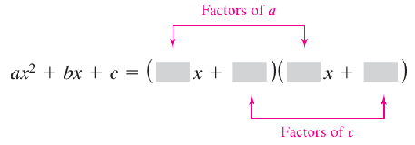

# A.3: Polynomials and Factoring

These are algebraic expressions with variables raised to exponents and added together, etc. but *no other* functions/operations on them.

Examples:

* $2x+5$
* $3x^4 - 7x^2 + 2x+4$

The two above are polynomials in $x$.  The following is a polynomial in $x$ and $y$:

* $5x^2 y^2-xy+3$

Each term in a polynomial has the form $ax^k$ where $a$ is the coefficient and $k$ is the *degree* of that term.  

## Standard Form

To write a polynomial in standard form, we write out the terms in *descending* order of $k$:  For a polynomial, the *leading coefficient* is the first coefficient in standard form and the *degree* of the polynomial is the degree of the first term.  Note that we often say that an $n$th degree polynomial an $n$th order polynomial.

> ### Example
>
> What is $4x^2-5x^7-2+3x$ in standard form?  What is the leading coefficient and degree of the polynomial.
>
> 

Answer
The expression in standard form is <math><mrow><mo>−</mo></mrow><mrow><mn>5</mn><msup><mi>x</mi><mn class="tml-sml-pad">7</mn></msup><mo>+</mo></mrow><mrow><mn>4</mn><msup><mi>x</mi><mn class="tml-sml-pad">2</mn></msup><mo>+</mo></mrow><mrow><mn>3</mn><mi>x</mi><mo>−</mo></mrow><mrow><mn>2</mn></mrow></math>.  The leading coefficient is -5 and this is a 7th degree polynomial.

## Operations with Polynomials

* You can add and subtract polynomials just like numbers: just make sure you group *like terms* (terms with the same dependencies on your variables.

> ### Example
>
> Write out $(2x^3-x+3) - (x^2 - 2x-3)$ in standard form.
>
> 

Answer
The key is to look at terms with respect to each xn and group them together, then order: <math display="block" class="tml-display" style="display:block math;"><mrow><mn>2</mn><msup><mi>x</mi><mn class="tml-sml-pad">3</mn></msup><mo>−</mo><mi>x</mi><mo>+</mo><mn>3</mn><mo>−</mo><msup><mi>x</mi><mn class="tml-sml-pad">2</mn></msup><mo>+</mo><mn>2</mn><mi>x</mi><mo>+</mo><mn>3</mn><mo>=</mo><mn>2</mn><msup><mi>x</mi><mn class="tml-sml-pad">3</mn></msup><mo>−</mo><msup><mi>x</mi><mn class="tml-sml-pad">2</mn></msup><mo>+</mo><mo form="prefix" stretchy="false">(</mo><mn>2</mn><mo>−</mo><mn>1</mn><mo form="postfix" stretchy="false">)</mo><mi>x</mi><mo>+</mo><mo form="prefix" stretchy="false">(</mo><mn>3</mn><mo>−</mo><mn>3</mn><mo form="postfix" stretchy="false">)</mo><mo>=</mo><mn>2</mn><msup><mi>x</mi><mn class="tml-sml-pad">3</mn></msup><mo>−</mo><msup><mi>x</mi><mn class="tml-sml-pad">2</mn></msup><mo>+</mo><mi>x</mi></mrow></math>

* You can find the product of two polynomials by using *distributive properties* and multiply out the terms in products, such that you group terms.

*OpenStax Elementary Algebra 2e*

> ### Example
>
> Multiply $(4x+3)(2x-5)$
>
> 

Answer
<math><mrow><mo form="prefix" stretchy="false">(</mo><mn>4</mn><mi>x</mi><mo>+</mo><mn>3</mn><mo form="postfix" stretchy="false">)</mo><mo form="prefix" stretchy="false">(</mo><mn>2</mn><mi>x</mi><mo>−</mo><mn>5</mn><mo form="postfix" stretchy="false">)</mo><mo>=</mo></mrow><mrow><mo form="prefix" stretchy="false">(</mo><mn>4</mn><mi>x</mi><mo form="postfix" stretchy="false">)</mo><mo form="prefix" stretchy="false">(</mo><mn>2</mn><mi>x</mi><mo form="postfix" stretchy="false">)</mo><mo>+</mo></mrow><mrow><mo form="prefix" stretchy="false">(</mo><mn>4</mn><mi>x</mi><mo form="postfix" stretchy="false">)</mo><mo form="prefix" stretchy="false">(</mo><mo form="prefix" stretchy="false">−</mo><mn>5</mn><mo form="postfix" stretchy="false">)</mo><mo>+</mo></mrow><mrow><mo form="prefix" stretchy="false">(</mo><mn>3</mn><mo form="postfix" stretchy="false">)</mo><mo form="prefix" stretchy="false">(</mo><mn>2</mn><mi>x</mi><mo form="postfix" stretchy="false">)</mo><mo>+</mo></mrow><mrow><mo form="prefix" stretchy="false">(</mo><mn>3</mn><mo form="postfix" stretchy="false">)</mo><mo form="prefix" stretchy="false">(</mo><mo form="prefix" stretchy="false">−</mo><mn>5</mn><mo form="postfix" stretchy="false">)</mo><mo>=</mo></mrow><mrow><mn>8</mn><msup><mi>x</mi><mn class="tml-sml-pad">2</mn></msup><mo>−</mo></mrow><mrow><mn>20</mn><mi>x</mi><mo>+</mo></mrow><mrow><mn>6</mn><mi>x</mi><mo>−</mo></mrow><mrow><mn>15</mn><mo>=</mo></mrow><mrow><mn>8</mn><msup><mi>x</mi><mn class="tml-sml-pad">2</mn></msup><mo>−</mo></mrow><mrow><mn>14</mn><mi>x</mi><mo>−</mo></mrow><mrow><mn>15</mn></mrow></math>

> ### Class Question
>
> Find the product $(x + 5)(x^2 - 5x + 25)$
>
> 

Answer
<math><mrow><mo form="prefix" stretchy="false">(</mo><mi>x</mi><mo>+</mo><mn>5</mn><mo form="postfix" stretchy="false">)</mo><mo form="prefix" stretchy="false">(</mo><msup><mi>x</mi><mn class="tml-sml-pad">2</mn></msup><mo>−</mo><mn>5</mn><mi>x</mi><mo>+</mo><mn>25</mn><mo form="postfix" stretchy="false">)</mo><mo>=</mo></mrow><mrow><msup><mi>x</mi><mn class="tml-sml-pad">3</mn></msup><mo>−</mo></mrow><mrow><mn>5</mn><msup><mi>x</mi><mn class="tml-sml-pad">2</mn></msup><mo>+</mo></mrow><mrow><mn>25</mn><mi>x</mi><mo>+</mo></mrow><mrow><mn>5</mn><msup><mi>x</mi><mn class="tml-sml-pad">2</mn></msup><mo>−</mo></mrow><mrow><mn>25</mn><mi>x</mi><mo>+</mo></mrow><mrow><mn>125</mn><mo>=</mo></mrow><mrow><msup><mi>x</mi><mn class="tml-sml-pad">3</mn></msup><mo>+</mo></mrow><mrow><mn>125</mn></mrow></math>

### Special Products

There are some binomials that you should remember as they will be useful throughout the course.  You should be able to derive these expressions yourselves.

#### Difference of Squares

* $(u+v)(u-v) = u^2 - v^2$

#### Squares of Binomials

* $(u+v)^2 = u^2 + 2uv + v^2$
* $(u-v)^2 = u^2 - 2uv + v^2$

#### Cubes of Binomials[^1]

* $(u+v)^3 = u^3 + 3u^2v + 3uv^2 + v^3$
* $(u-v)^3 = u^3 - 3u^2 v + 3uv^2 - v^3$ [^2 ]

#### Sums or Differences of Two Cubes

* $u^3 + v^3 = (u+v)(u^2 -uv + v^2)$
* $u^3-v^3 = (u-v)(u^2 + uv + v^2)$

> #### Example
>
> Find the product $(x-2+3y)(x-2-3y)$.
>
> 

Answer
The key here is to recognize that we can group <math><mi>x</mi><mo>-</mo><mn>2</mn></math>, so that we can treat it as a difference of squares: <math><mrow><mo form="prefix" stretchy="false">(</mo><mi>x</mi><mo>−</mo><mn>2</mn><mo>+</mo><mn>3</mn><mi>y</mi><mo form="postfix" stretchy="false">)</mo><mo form="prefix" stretchy="false">(</mo><mi>x</mi><mo>−</mo><mn>2</mn><mo>−</mo><mn>3</mn><mi>y</mi><mo form="postfix" stretchy="false">)</mo><mo>=</mo></mrow><mrow><mo form="prefix" stretchy="false">[</mo><mo form="prefix" stretchy="false">(</mo><mi>x</mi><mo>−</mo><mn>2</mn><mo form="postfix" stretchy="false">)</mo><mo>+</mo><mn>3</mn><mi>y</mi><mo form="postfix" stretchy="false">]</mo><mo form="prefix" stretchy="false">[</mo><mo form="prefix" stretchy="false">(</mo><mi>x</mi><mo>−</mo><mn>2</mn><mo form="postfix" stretchy="false">)</mo><mo>−</mo><mn>3</mn><mi>y</mi><mo form="postfix" stretchy="false">]</mo><mo>=</mo></mrow><mrow><mo form="prefix" stretchy="false">(</mo><mi>x</mi><mo>−</mo><mn>2</mn><msup><mo form="postfix" stretchy="false">)</mo><mn>2</mn></msup><mo>−</mo><mo form="prefix" stretchy="false">(</mo><mn>3</mn><mi>y</mi><msup><mo form="postfix" stretchy="false">)</mo><mn>2</mn></msup><mo>=</mo><msup><mi>x</mi><mn class="tml-sml-pad">2</mn></msup><mo>−</mo><mn>4</mn><mi>x</mi><mo>+</mo><mn>4</mn><mo>−</mo><mn>9</mn><msup><mi>y</mi><mn class="tml-sml-pad">2</mn></msup></mrow></math>.  If I were to express this in standard form I would then move the y2 term further up.

## Factoring Polynomials

Here, we *write a polynomial as a product*.  Generally, we look for factors with *integer* coefficients.

* Sometimes, polynomials are *prime* and cannot be factored further with integer coefficients.  For example, $x^2-3$ is prime as this cannot be broken down further without going into non-integer coefficients.[^3]
* When every factor in the expression is prime, it is completely factored.

> ### Examples
>
> * $(x-1)(x^2+4)$ is prime since we can't actually factor $x^2+4$ further.
> * $(x-1)(x^2-4)$ is *not* prime since we can still factor $x^2 - 4 = (x+2)(x-2)$, so to completely factor this expression we have $$(x-1)(x+2)(x-2)$$.

Ultimately, to factor a polynomial the key is to

* Recognize patterns (especially with the special products we just discussed)
* Identify common factors
* Practice

> ### Examples
>
> Factorize the following:
>
> 1. $-4x^2+12x-16$
> 2. $100-4y^2$
> 3. $x^3+216$
>
> 

Answer to Q. 1
Since all of these have 4 as a factor, we can start by taking out 4, so <math><mrow><mn>4</mn><mo form="prefix" stretchy="false">(</mo><mo form="prefix" stretchy="false">−</mo><msup><mi>x</mi><mn class="tml-sml-pad">2</mn></msup><mo>+</mo><mn>3</mn><mi>x</mi><mo>−</mo><mn>4</mn><mo form="postfix" stretchy="false">)</mo></mrow></math>.  You can see that the term in brackets is prime.

>
> 

Answer to Q. 2
This time, we start by factoring by 4, so we have <math><mrow><mn>4</mn><mo form="prefix" stretchy="false">(</mo><mn>25</mn><mo>−</mo><msup><mi>y</mi><mn class="tml-sml-pad">2</mn></msup><mo form="postfix" stretchy="false">)</mo></mrow></math>.  Now, we recognize that 25 = 52, so we have an a2-b2 situation.  Therefore, we have <math><mrow><mn>4</mn><mo form="prefix" stretchy="false">(</mo><mn>5</mn><mo>+</mo><mi>y</mi><mo form="postfix" stretchy="false">)</mo><mo form="prefix" stretchy="false">(</mo><mn>5</mn><mo>−</mo><mi>y</mi><mo form="postfix" stretchy="false">)</mo></mrow></math>

>
> 

Answer to Q. 3
This time it takes a bit more thought.  I would suggest (since it is hard to recognize) we completely factorize 216, which we find to be <math><mrow><msup><mn>2</mn><mn>3</mn></msup><mo>×</mo></mrow><mrow><msup><mn>3</mn><mn>3</mn></msup></mrow></math>.  Now, this means that the term is <math><mrow><msup><mi>x</mi><mn class="tml-sml-pad">3</mn></msup><mo>+</mo></mrow><mrow><msup><mn>6</mn><mn>3</mn></msup></mrow></math>.  Using the sum of cubes above, we find that this is <math><mrow><mo form="prefix" stretchy="false">(</mo><mi>x</mi><mo>+</mo><mn>6</mn><mo form="postfix" stretchy="false">)</mo><mo form="prefix" stretchy="false">(</mo><msup><mi>x</mi><mn class="tml-sml-pad">2</mn></msup><mo>−</mo><mn>6</mn><mi>x</mi><mo>+</mo><mn>36</mn><mo form="postfix" stretchy="false">)</mo></mrow></math>.
> 

> ### Class Question
>
> Factorize $x^2 (x-6) - (x-6)$.
>
> 

Answer
<math><mrow><mo form="prefix" stretchy="false">(</mo><msup><mi>x</mi><mn class="tml-sml-pad">2</mn></msup><mo>−</mo><mn>1</mn><mo form="postfix" stretchy="false">)</mo><mo form="prefix" stretchy="false">(</mo><mi>x</mi><mo>−</mo><mn>6</mn><mo form="postfix" stretchy="false">)</mo><mo>=</mo></mrow><mrow><mo form="prefix" stretchy="false">(</mo><mi>x</mi><mo>+</mo><mn>1</mn><mo form="postfix" stretchy="false">)</mo><mo form="prefix" stretchy="false">(</mo><mi>x</mi><mo>−</mo><mn>1</mn><mo form="postfix" stretchy="false">)</mo><mo form="prefix" stretchy="false">(</mo><mi>x</mi><mo>−</mo><mn>6</mn><mo form="postfix" stretchy="false">)</mo></mrow></math>

### Factoring Trinomials

Often, we find that a trinomial of the form $ax^2+bx+c$  can be factorized into something of the form

Often, the approach then is to do some sort of *trial and improvement* to find something that expands to the original polynomial.  Just remember that

* The coefficients of $x$ will multiply out to yield $a$
* The coefficients of the constant terms in each bracket will multiply out to $c$.
* Your cross terms need to add up to get you the $bx$ term.

The first two steps would give you the signs of what is in the brackets.

> #### Examples
>
> Factor completely:
>
> 1. $16+6x-x^2$
> 2. $5x^2+26x+5$
>
> 

Answer to Q. 1
Since we see that we have to have a negative x value and a positive number at the front, we find that the answer has to be of the form <math><mrow><mo form="prefix" stretchy="false">(</mo><mi>a</mi><mo>+</mo><mi>x</mi><mo form="postfix" stretchy="false">)</mo><mo form="prefix" stretchy="false">(</mo><mi>b</mi><mo>−</mo><mi>x</mi><mo form="postfix" stretchy="false">)</mo></mrow></math>.  Looking more carefully, we find the solution to be <math display="block" class="tml-display" style="display:block math;"><mrow><mo form="prefix" stretchy="false">(</mo><mn>8</mn><mo>-</mo><mi>x</mi><mo form="postfix" stretchy="false">)</mo><mo form="prefix" stretchy="false">(</mo><mn>2</mn><mo>+</mo><mi>x</mi><mo form="postfix" stretchy="false">)</mo></mrow></math>
>     Alternatively, what I actually like to do is to make the leading coefficient positive first by taking a negative sign, so <math><mrow><mo>−</mo></mrow><mrow><mo form="prefix" stretchy="false">(</mo><msup><mi>x</mi><mn class="tml-sml-pad">2</mn></msup><mo>−</mo><mn>6</mn><mi>x</mi><mo>−</mo><mn>16</mn><mo form="postfix" stretchy="false">)</mo></mrow></math>.  In this case, since the constant term is negative, we must have <math><mrow><mo form="prefix" stretchy="false">(</mo><mi>x</mi><mo>+</mo><mi>a</mi><mo form="postfix" stretchy="false">)</mo><mo form="prefix" stretchy="false">(</mo><mi>x</mi><mo>−</mo><mi>b</mi><mo form="postfix" stretchy="false">)</mo></mrow></math>, and then <math><mrow><mo>−</mo></mrow><mrow><mo form="prefix" stretchy="false">(</mo><mi>x</mi><mo>−</mo><mn>8</mn><mo form="postfix" stretchy="false">)</mo><mo form="prefix" stretchy="false">(</mo><mi>x</mi><mo>+</mo><mn>2</mn><mo form="postfix" stretchy="false">)</mo></mrow></math>
>
> 

Answer to Q. 2
Here, we realize that since all the coefficients/terms are positive and we have a leading coefficient of 5, it has to be of the form <math><mrow><mo form="prefix" stretchy="false">(</mo><mn>5</mn><mi>x</mi><mo>+</mo><mi>a</mi><mo form="postfix" stretchy="false">)</mo><mo form="prefix" stretchy="false">(</mo><mi>x</mi><mo>+</mo><mi>b</mi><mo form="postfix" stretchy="false">)</mo></mrow></math>.  It turns out to be <math><mrow><mo form="prefix" stretchy="false">(</mo><mn>5</mn><mi>x</mi><mo>+</mo><mn>1</mn><mo form="postfix" stretchy="false">)</mo><mo form="prefix" stretchy="false">(</mo><mi>x</mi><mo>+</mo><mn>5</mn><mo form="postfix" stretchy="false">)</mo></mrow></math> to yield the necessary +26x term.

> #### Class Question
>
> Factor completely $x^2+15x+54$ or state that it is prime.
>
> 

Answer
(x+9)(x+6)

### Factoring by Grouping

Sometimes the approach to factoring is to group together terms that would then allow you to factor it out.  This is especially true if it is something bigger than a trinomial:

* The key here is to pair up terms so that you can create something that seems suspiciously like what is left over multiplied by some factor.

> #### Examples
>
> Factor completely $5-x+5x^2 - x^3$.
>
> 

Answer
The key here is to realize that we have a pattern of coefficients that looks like <math><mn>5</mn><mo>-</mo><mi>x</mi></math>.  Given this, we group the first two terms and the last two terms and get <math display="block" class="tml-display" style="display:block math;"><mrow><mo form="prefix" stretchy="false">(</mo><mn>5</mn><mo>−</mo><mi>x</mi><mo form="postfix" stretchy="false">)</mo><mo>+</mo><mo form="prefix" stretchy="false">(</mo><mn>5</mn><msup><mi>x</mi><mn class="tml-sml-pad">2</mn></msup><mo>−</mo><msup><mi>x</mi><mn class="tml-sml-pad">3</mn></msup><mo form="postfix" stretchy="false">)</mo><mo>=</mo><mo form="prefix" stretchy="false">(</mo><mn>5</mn><mo>−</mo><mi>x</mi><mo form="postfix" stretchy="false">)</mo><mo>+</mo><msup><mi>x</mi><mn class="tml-sml-pad">2</mn></msup><mo form="prefix" stretchy="false">(</mo><mn>5</mn><mo>−</mo><mi>x</mi><mo form="postfix" stretchy="false">)</mo><mo>=</mo><mo form="prefix" stretchy="false">(</mo><mn>5</mn><mo>−</mo><mi>x</mi><mo form="postfix" stretchy="false">)</mo><mo form="prefix" stretchy="false">(</mo><mn>1</mn><mo>+</mo><msup><mi>x</mi><mn class="tml-sml-pad">2</mn></msup><mo form="postfix" stretchy="false">)</mo></mrow></math>

> #### Class Question
>
> Factor completely by grouping $x^3-3x^2+2x-6$
>
> 

Answer
<math><mrow><msup><mi>x</mi><mn class="tml-sml-pad">3</mn></msup><mo>−</mo></mrow><mrow><mn>3</mn><msup><mi>x</mi><mn class="tml-sml-pad">2</mn></msup><mo>+</mo></mrow><mrow><mn>2</mn><mi>x</mi><mo>−</mo></mrow><mrow><mn>6</mn><mo>=</mo></mrow><mrow><msup><mi>x</mi><mn class="tml-sml-pad">2</mn></msup><mo form="prefix" stretchy="false">(</mo><mi>x</mi><mo>−</mo><mn>3</mn><mo form="postfix" stretchy="false">)</mo><mo>+</mo></mrow><mrow><mn>2</mn><mo form="prefix" stretchy="false">(</mo><mi>x</mi><mo>−</mo><mn>3</mn><mo form="postfix" stretchy="false">)</mo><mo>=</mo></mrow><mrow><mo form="prefix" stretchy="false">(</mo><msup><mi>x</mi><mn class="tml-sml-pad">2</mn></msup><mo>+</mo><mn>2</mn><mo form="postfix" stretchy="false">)</mo><mo form="prefix" stretchy="false">(</mo><mi>x</mi><mo>−</mo><mn>3</mn><mo form="postfix" stretchy="false">)</mo></mrow></math>

Sometimes it is useful to solve a trinomial by splitting the middle term in a way that allows you to group them.[^4]

> #### Examples
>
> Factor completely $6x^2+x-2$.
>
> 

Answer
The crux here is to look at the first and last terms, and think about what sort of thing might come out.  Again, this might be trial and error.  Looking at this, I see that I have a six in front.  Somehow I need to think about how to break down <math><mo>+</mo><mi>x</mi></math> so that it splits into two terms that then share a single factor.  I also note that the last term is -2, so I would probably want a minus in front of the first term and a plus in front of the second term: something like <math><mrow><mo form="prefix" stretchy="false">(</mo><mn>6</mn><msup><mi>x</mi><mn class="tml-sml-pad">2</mn></msup><mo>−</mo><mi>ax</mi><mo form="postfix" stretchy="false">)</mo><mo>+</mo></mrow><mrow><mo form="prefix" stretchy="false">(</mo><mi>b</mi><mi>x</mi><mo>−</mo><mn>2</mn><mo form="postfix" stretchy="false">)</mo></mrow></math>.  If we try b = 4 here, then we would need a = 3 to get the sum of the coefficients of x to be +1.  In this case:<math display="block" class="tml-display" style="display:block math;"><mrow><mo form="prefix" stretchy="false">(</mo><mn>6</mn><msup><mi>x</mi><mn class="tml-sml-pad">2</mn></msup><mo>−</mo><mn>3</mn><mi>x</mi><mo form="postfix" stretchy="false">)</mo><mo>+</mo><mo form="prefix" stretchy="false">(</mo><mn>4</mn><mi>x</mi><mo>−</mo><mn>2</mn><mo form="postfix" stretchy="false">)</mo><mo>=</mo><mn>3</mn><mi>x</mi><mo form="prefix" stretchy="false">(</mo><mn>2</mn><mi>x</mi><mo>−</mo><mn>1</mn><mo form="postfix" stretchy="false">)</mo><mo>+</mo><mn>2</mn><mo form="prefix" stretchy="false">(</mo><mn>2</mn><mi>x</mi><mo>−</mo><mn>1</mn><mo form="postfix" stretchy="false">)</mo><mo>=</mo><mo form="prefix" stretchy="false">(</mo><mn>3</mn><mi>x</mi><mo>+</mo><mn>2</mn><mo form="postfix" stretchy="false">)</mo><mo form="prefix" stretchy="false">(</mo><mn>2</mn><mi>x</mi><mo>−</mo><mn>1</mn><mo form="postfix" stretchy="false">)</mo></mrow></math>

[^1]: In principle, you can extend this somewhat straightforwardly using [Pascal's Triangle](https://openstax.org/books/intermediate-algebra-2e/pages/12-4-binomial-theorem).
[^2]: Be sure to alternate the signs when you have minuses.
[^3]: You can show that $x^2 - 3 = (x+\sqrt{3})(x-\sqrt{3})$, but this would not have integer constant terms in each of the two factors.
[^4]: Personally I think that this is usually overkill for this purpose, but is a useful introduction to solving quadratic equations by completing the square.